# HLD – High-Level Design: The Story Edition
### From First Principles to System Design, Told as Stories

> **How to read this:** Every concept starts with a real problem story that makes you *feel* why the concept exists. Then the solution, the diagram, and the clean explanation. By the end you should be able to draw any of these on a whiteboard and talk through your decisions confidently.

---

## Frequency Legend

| Badge | Meaning |
|-------|---------|
| 🔥 Must Know | Core to every system design discussion |
| ⚡ Important | Comes up often in mid-to-senior interviews |
| 📘 Good to Know | Shows depth and breadth |

---

## Reading Map

```
Foundation Layer
  🔥 HLD vs LLD · Scalability · Load Balancing · Caching · CDN

Data Layer
  🔥 SQL vs NoSQL · Sharding · Replication · Indexing · Storage Types

Communication Layer
  🔥 APIs · Message Queues · Event-Driven · Service Discovery · API Gateway

Reliability Layer
  🔥 CAP Theorem · Consistency Models · Circuit Breaker · Rate Limiting · HA & DR

Observability Layer
  ⚡ Logging · Metrics · Distributed Tracing

System Design Case Studies
  🔥 URL Shortener · Rate Limiter · Notification System
  ⚡ Chat System · News Feed · Video Streaming · Ride Sharing
```

---

# Part 1 – Foundation Layer

---

## HLD vs LLD 🔥

**Story:** Your tech lead says "design a food delivery system." Where do you start? If you dive straight into `class Order` and its methods, you've skipped the big picture. HLD is the architect's blueprint of the building. LLD is the detailed floor plan of one room.

| | HLD | LLD |
|--|-----|-----|
| **Focus** | System components & interactions | Classes, methods, data structures |
| **Audience** | Architects, stakeholders | Developers |
| **Output** | Block diagram, data flow | Class diagrams, sequence diagrams |
| **Questions answered** | "What services exist and how do they connect?" | "How does this service work internally?" |
| **Tools** | Boxes & arrows, APIs, DBs | Design patterns, code structure |

**Interview tip:** Always start with HLD (clarify requirements, estimate scale, design components) before going LLD (internals of one component).

---

## Scalability 🔥

**Story:** Your startup launches and 100 users sign up. Your single server handles it fine. Then you get featured on a news site – 100,000 users hit at once. Server crashes. You had no plan for scale.

### Vertical Scaling (Scale-Up)
Add more power to the existing machine (more CPU, RAM, faster SSD).

- **Pros:** Simple, no code change, no distribution complexity
- **Cons:** Hardware ceiling, single point of failure, expensive beyond a point
- **Good for:** Databases (easier to scale up than out)

### Horizontal Scaling (Scale-Out)
Add more machines, distribute the load.

- **Pros:** Near-limitless, fault-tolerant, cost-effective with commodity hardware
- **Cons:** Needs load balancing, stateless design required, distributed systems complexity
- **Good for:** Web servers, API servers, microservices


**Interview answer:** *"Start with vertical for simplicity. Design stateless services so horizontal scaling is possible. Use load balancers to distribute traffic. Store session state externally (Redis) so any server can handle any request."*

---

## Load Balancing 🔥

**Story:** You have 5 servers. Without a load balancer, you'd have to tell every client which server to use. Clients don't know which servers are alive, which are busy, or how to failover. The load balancer is the invisible traffic cop.

### Algorithms

| Algorithm | How | Best for |
|-----------|-----|---------|
| **Round Robin** | Next server in cycle | Equal capacity servers |
| **Weighted Round Robin** | Servers with more power get more requests | Mixed capacity |
| **Least Connections** | Route to server with fewest active connections | Long-lived connections |
| **IP Hash** | Hash client IP → always same server | Session stickiness |
| **Random** | Pick any server randomly | Simple, surprisingly effective |

### Layer 4 vs Layer 7

| | L4 (Transport) | L7 (Application) |
|--|----------------|-----------------|
| Routes by | IP + TCP port | HTTP headers, URL, cookies |
| Content-aware | No | **Yes** |
| Speed | Faster | Slightly slower |
| Example | AWS NLB | AWS ALB, Nginx |


**Health checks:** LB pings each server (`/health`) every N seconds. If a server fails 3 consecutive checks → removed from rotation. Automatically added back when it recovers.

---

## Caching 🔥

**Story:** Your product page loads in 800ms because every visit runs 12 DB queries. For the same product, the same queries run 50,000 times a day. You're querying the same unchanging data 50,000 times. A cache cuts this to 1 DB query + 49,999 cache reads at ~1ms each.

### Cache Levels


### Cache Patterns

**Cache-Aside (Lazy Loading) – Most common:**
```
Read:  Check cache → miss → read DB → write to cache → return
Write: Update DB → invalidate cache (or update cache)
```

**Write-Through:**
```
Write: Write to cache → write to DB (synchronous)
Read:  Always hits cache (warm)
```

**Write-Behind (Write-Back):**
```
Write: Write to cache → return (DB updated asynchronously later)
Risk:  Data loss if cache crashes before DB write
```

**Read-Through:**
```
Cache sits in front of DB; on miss, cache fetches from DB itself
```

### Cache Invalidation Strategies

| Strategy | How | When |
|---------|-----|------|
| **TTL (Time-to-Live)** | Auto-expire after N seconds | Data that goes stale predictably |
| **Event-driven** | Invalidate on write event | Strong consistency needed |
| **Write-through** | Update cache on every write | Read-heavy, consistent data |
| **LRU Eviction** | Evict least-recently-used on full | General purpose |

**Cache stampede:** Cache key expires → 1000 requests all miss → all hit DB simultaneously.  
**Fix:** Probabilistic early expiry, mutex lock on first miss (only one request fetches, others wait), or background refresh.

---

## CDN (Content Delivery Network) ⚡

**Story:** Your servers are in Mumbai. A user in New York loads your website – every asset (images, JS, CSS) travels 14,000 km round-trip. With a CDN, a copy is cached on a server in New York. Assets load from 20km away instead of 14,000km.

**What CDN caches:** Static assets (images, CSS, JS, videos), API responses (if cache-able), entire HTML pages.

**How it works:**
1. User requests `https://cdn.yourapp.com/logo.png`
2. DNS resolves to nearest CDN **PoP** (Point of Presence)
3. CDN checks its cache → **hit**: return immediately; **miss**: fetch from **origin** server, cache it, return
4. Next user at same location → served from cache

**CDN providers:** Cloudflare, AWS CloudFront, Akamai, Fastly

**Interview use:** Mention CDN whenever the problem involves: global users, static content, reducing origin server load, or video streaming.

---

# Part 2 – Data Layer

---

## SQL vs NoSQL – When and Why 🔥

**Story:** You're designing a hospital system. Patient records have strict relationships (doctor ↔ patient ↔ prescription ↔ drug). You need ACID guarantees – a prescription can't exist without a patient. Use SQL. Now you're building a product catalogue for an e-commerce site with wildly different attributes per product (a shoe has size; a laptop has RAM). Forcing every product into the same relational schema is painful. Use MongoDB.


| DB | Use case | Key strength |
|----|---------|-------------|
| PostgreSQL / MySQL | Orders, users, finance | ACID, joins, constraints |
| MongoDB | Catalogs, CMS, user profiles | Flexible schema, document model |
| Redis | Cache, sessions, leaderboards | In-memory, sub-ms latency |
| Cassandra | IoT, time series, write-heavy | Linear horizontal scale, no SPOF |
| Elasticsearch | Full-text search, log analysis | Inverted index, fast text search |
| Neo4j | Social graphs, recommendations | Native graph traversal |

---

## Database Replication 🔥

**Story:** Your single DB server handles 500 reads/sec + 100 writes/sec. It's maxed out. Reads are 5x writes. You add read replicas: writes go to primary, reads spread across replicas. Throughput quintuples.


**Replication lag:** Async replication means replicas may be slightly behind (milliseconds to seconds). Read your own writes? Route that user's reads to primary temporarily.

**Failover:** If primary fails, promote a replica to primary. This is how managed DBs (AWS RDS Multi-AZ) work – standby replica in another AZ, automatic failover in ~60s.

---

## Database Sharding ⚡

**Story:** Your user table has 500 million rows. Even with indexes, queries slow down. No single server can hold it all. You split the table across multiple DB servers – each server holds a *shard* (subset of data).

**Sharding strategies:**

| Strategy | How | Pros | Cons |
|----------|-----|------|------|
| **Range-based** | Users A-M on shard 1, N-Z on shard 2 | Simple, range queries easy | Hot spots (most users start with common letters) |
| **Hash-based** | `shard = hash(userId) % N` | Even distribution | No range queries; resharding painful |
| **Directory-based** | Lookup table: userId → shard | Flexible | Lookup table is a bottleneck/SPOF |


**Challenges:** Cross-shard joins (hard), distributed transactions (very hard), resharding (painful – consistent hashing helps). **Avoid sharding until you actually need it.**

---

## Storage Types ⚡

| Type | What it is | Examples | Use case |
|------|-----------|---------|---------|
| **Block Storage** | Raw disk blocks, like a hard drive | AWS EBS | DBs, VMs, anything needing a filesystem |
| **Object Storage** | Store files as objects with metadata | AWS S3, GCS | Images, videos, backups, logs, data lakes |
| **File Storage** | Shared filesystem, mountable | AWS EFS, NFS | Shared files between multiple servers |

**Rule of thumb:** Images/videos/documents → **S3**. DB data → **EBS**. Shared config/logs across servers → **EFS**.

---

# Part 3 – Communication Layer

---

## API Design 🔥

**Story:** Your mobile app, web app, and third-party partners all talk to your backend. Without a clear API contract, every team builds something slightly different. Versioning breaks. Partners can't upgrade. One endpoint change breaks 3 clients.

### REST Best Practices

- **Nouns, not verbs:** `GET /orders/123` not `GET /getOrder?id=123`
- **HTTP methods mean something:** GET (read), POST (create), PUT (replace), PATCH (partial update), DELETE (remove)
- **Status codes:** 200 OK, 201 Created, 400 Bad Request, 401 Unauthorized, 403 Forbidden, 404 Not Found, 409 Conflict, 429 Too Many Requests, 500 Internal Server Error
- **Pagination:** `GET /orders?page=2&size=20` or cursor-based `?after=cursor_xyz` (cursor-based is better for large datasets)
- **Versioning:** `GET /api/v1/orders` or `Accept: application/vnd.api.v2+json`

### REST vs gRPC vs GraphQL

| | REST | gRPC | GraphQL |
|--|------|------|---------|
| Format | JSON / HTTP | Protobuf / HTTP2 | JSON / HTTP |
| Performance | Moderate | **Fastest** | Moderate |
| Type safety | No | **Strong (proto schema)** | Strong (schema) |
| Streaming | No | **Yes (bidirectional)** | Subscriptions |
| Best for | Public APIs, browser | Service-to-service | Flexible client queries |
| Over/under-fetching | Possible | No (defined contract) | **Eliminated** |

---

## Message Queues & Event-Driven Architecture 🔥

**Story:** Order service places order → needs to: charge payment, update inventory, send confirmation email, notify warehouse. If done synchronously: one failure rolls back everything, slow services block the order, tightly coupled. Async via a message queue: order service publishes "OrderPlaced" event and returns 200ms. Other services process independently at their own pace.


**Benefits of async:**
- **Decoupling:** Services don't know about each other
- **Resilience:** Broker buffers messages if consumer is down
- **Scalability:** Each consumer scales independently
- **Replay:** Kafka retains events; reprocess if needed

**When to use sync (REST/gRPC):** When you need an immediate response (user-facing, real-time, queries).  
**When to use async (queue):** When eventual processing is acceptable (notifications, batch, analytics).

---

## API Gateway 🔥

**Story:** You have 15 microservices. Mobile apps, web apps, and partners all need to reach them. Without a gateway: clients need to know 15 different addresses; auth is repeated in every service; rate limiting is in every service; CORS is everywhere. The API Gateway is the single front door.


**What the gateway handles:**
- **Authentication & Authorization** – validate JWT once, not in every service
- **Rate Limiting** – per client, per endpoint
- **SSL Termination** – HTTPS terminates at gateway; internal traffic is HTTP
- **Request routing** – `/orders/*` → Order Service, `/users/*` → User Service
- **Load balancing** – across instances of each service
- **Request/response transformation** – aggregate, filter, transform
- **Observability** – access logs, metrics per endpoint

**Examples:** AWS API Gateway, Kong, Nginx, Spring Cloud Gateway

---

## Service Discovery ⚡

**Story:** In microservices, service instances come and go (containers restart, scale up/down, crash). You can't hardcode IP addresses. Service A needs to find Service B's current address dynamically.

**Client-side discovery:** Service queries a **registry** (e.g., Eureka) for the address, then calls directly with client-side load balancing (Ribbon).

**Server-side discovery:** Client calls a load balancer; LB queries registry and routes (AWS ALB + ECS, Kubernetes Service).


**In Kubernetes:** No external registry needed. `Service` object gives a stable DNS name (`payment-service.default.svc.cluster.local`) to a dynamic set of pods. Kubernetes handles discovery natively.

---

# Part 4 – Reliability Layer

---

## CAP Theorem 🔥

**Story:** You have a distributed database with two nodes. A network partition happens – they can't talk to each other. A write comes in to node 1. Do you: (A) accept the write, risking node 2 returning stale data (choose Availability)? Or (B) reject the write until the nodes reconnect (choose Consistency)?


**The truth:** Partition tolerance is not optional in distributed systems (networks always fail). So the real choice is **CP vs AP**:

| Choice | Behaviour during partition | Examples |
|--------|--------------------------|---------|
| **CP** | Reject requests to maintain consistency | ZooKeeper, HBase, traditional RDBMS |
| **AP** | Serve possibly stale data to stay available | Cassandra, DynamoDB, Couchbase |

**Interview answer:** *"CAP says you can't have all three during a network partition. Since partitions happen, you choose CP (refuse to serve until consistent) or AP (serve stale data to stay available). Most real systems are AP with tunable consistency."*

---

## Consistency Models ⚡

**Story:** You post a tweet. Your friend hits refresh immediately – they don't see it yet. 2 seconds later it appears. The system is *eventually consistent*. For your bank balance, you'd want *strong consistency* – you can't see a stale balance after a withdrawal.

| Model | What it means | Example |
|-------|--------------|---------|
| **Strong Consistency** | Every read sees the latest write | Traditional RDBMS, ZooKeeper |
| **Eventual Consistency** | All nodes converge *eventually*; reads may be stale | DNS, S3, Cassandra |
| **Read-Your-Writes** | You always see your own writes | Routing your reads to primary after write |
| **Monotonic Reads** | Once you see data, you won't see older data | Sticky sessions to same replica |
| **Causal Consistency** | Operations causally related are seen in order | Chat (reply always after the message it replies to) |

---

## Circuit Breaker 🔥

**Story:** Payment service is down and taking 30 seconds to timeout. Order service keeps calling it for every order. 500 threads stack up waiting for timeouts. Thread pool exhausted. Order service dies too. One failing service brought down another. This is cascading failure.

**Circuit Breaker pattern:**


- **Closed:** Normal. Requests pass through.
- **Open:** Failing fast. Return error or fallback immediately. No calls to downstream.
- **Half-Open:** Letting one test request through. If it succeeds → Closed. If not → back to Open.

**Fallback strategies:**
- Return cached data
- Return a default/degraded response
- Queue the request for later

---

## Rate Limiting 🔥

**Story:** Your API is public. A scraper hits it 10,000 times per second. Your servers buckle. Legitimate users can't get through. Rate limiting is the bouncer at the door.

### Algorithms

**Token Bucket:** Bucket holds N tokens. Each request consumes 1 token. Tokens refill at a fixed rate. Allows bursts up to bucket size.

**Fixed Window Counter:** Count requests in a fixed time window (e.g., 100 req/min). Problem: 100 at 00:59 + 100 at 01:01 = 200 in 2 seconds.

**Sliding Window Log:** Store timestamp of each request. Count requests within the last window. Accurate but memory-heavy.

**Sliding Window Counter:** Weighted combination of current and previous window count. Balances accuracy and memory.

### Implementation with Redis

```
Key: rate:userId:window
On each request:
  1. INCR key → get count
  2. If count == 1: EXPIRE key windowSeconds
  3. If count > limit: reject with 429
```

**Where to rate limit:**
- **API Gateway:** Per client, per endpoint
- **Application level:** Per user, per resource
- **At the edge (CDN):** Block DDoS before it reaches servers

---

## High Availability & Disaster Recovery 🔥

**Story:** Your app goes down at 2AM on Black Friday. Every minute of downtime costs $50,000. High availability means designing so downtime is measured in seconds per year, not hours per incident.

### Key Metrics

| Metric | Formula | What it measures |
|--------|---------|----------------|
| **Availability** | uptime / (uptime + downtime) | % of time system is up |
| **RTO** | Recovery Time Objective | Max acceptable downtime after failure |
| **RPO** | Recovery Point Objective | Max acceptable data loss (how old can backup be?) |
| **MTTR** | Mean Time to Recover | Average time to recover from failure |
| **MTBF** | Mean Time Between Failures | Average time between failures |

### Availability Targets

| "Nines" | Downtime per year |
|---------|-----------------|
| 99% (two 9s) | 3.65 days |
| 99.9% (three 9s) | 8.77 hours |
| 99.99% (four 9s) | 52.6 minutes |
| 99.999% (five 9s) | 5.26 minutes |

### HA Design Patterns


**HA checklist:**
- Multi-AZ deployment (survive datacenter failure)
- Stateless application servers (any server handles any request)
- Health checks + automatic replacement (K8s does this)
- DB failover (primary → standby in < 60s with managed DB)
- Feature flags (kill switch for problematic features)
- Circuit breakers (prevent cascade failures)

---

## Distributed Tracing & Observability ⚡

**Story:** A customer calls: "My order is stuck." You check 8 microservices' logs individually. It takes 2 hours to find the bug in the inventory service. With distributed tracing, you search by order ID and see the entire request journey across all services in one screen, in 2 minutes.

### The Three Pillars

```mermaid
flowchart LR
  subgraph Observability
    L[Logs\nWhat happened]
    M[Metrics\nHow much / how fast]
    T[Traces\nWhere in the journey]
  end
  L --> ELK[ELK Stack]
  M --> Prometheus --> Grafana
  T --> Jaeger / Zipkin / OpenTelemetry
```

**Logs:** Structured JSON, correlation ID on every log line, log levels (DEBUG/INFO/WARN/ERROR).

**Metrics:**
- **Latency:** p50, p95, p99 response time
- **Traffic:** Requests per second
- **Errors:** Error rate, error count
- **Saturation:** CPU %, memory %, queue depth

**Traces:** Every request gets a **trace ID**. Each service operation gets a **span**. Spans form a tree showing the full call graph and timing.

**Alerting:** Alert on SLO breach, not just outages. E.g., alert when p99 latency > 500ms for 5 consecutive minutes.

---

# Part 5 – System Design Case Studies

---

## Case Study 1: Design a URL Shortener 🔥
*(e.g., bit.ly)*

**Requirements:** Long URL → short code (7 chars). Redirect short URL → long URL. ~100M links created/month, ~10B redirects/month.

**Scale estimation:**
- Writes: ~40 URLs/sec
- Reads: ~4000 redirects/sec (100:1 read:write ratio)
- Storage: 100M × 12 months × 500 bytes = ~600 GB/year

```mermaid
flowchart TB
  Client -->|POST /shorten| API[API Gateway + App Servers]
  API --> IDGen[ID Generator]
  IDGen -->|base62 encode| Code[shortCode: abc123x]
  Code --> DB[(URL DB: code, longUrl, userId, expiry)]
  Code --> Cache[Redis: code → longUrl]

  Browser -->|GET /abc123x| API
  API --> Cache
  Cache -->|miss| DB
  DB --> Redirect[301/302 Redirect → longUrl]
```



**Short code generation:**
- Option 1: **Auto-increment ID → Base62 encode** (digits + lowercase + uppercase = 62 chars). ID 125 → "cb". Predictable but sequential.
- Option 2: **MD5/SHA hash of long URL → take first 7 chars**. Fast but collision risk; need collision check.
- Option 3: **Pre-generate random codes** in a pool; assign on demand.

**301 vs 302:**
- 301 Permanent: Browser caches redirect. No more server hits. Can't track clicks.
- 302 Temporary: Browser always asks server. Server sees every click. Good for analytics.

**Deep dives:** Custom aliases, expiry dates, analytics (click count per code, geo), abuse prevention (blocklist of malicious URLs).

---

## Case Study 2: Design a Rate Limiter ⚡

**Requirements:** Limit each user to 100 API requests per minute. Return 429 if exceeded. Distributed (multiple app servers).

**Why distributed matters:** If you rate limit in each app server's memory, a user can hit 3 servers × 100 = 300 requests. Must share state (Redis).


**Sliding window implementation:**
```
Key: ratelimit:{userId}:{minuteTimestamp}
On request:
  INCR key
  EXPIRE key 60
  If value > 100: reject
```

**Response headers:** Always include:
```
X-RateLimit-Limit: 100
X-RateLimit-Remaining: 43
X-RateLimit-Reset: 1700000060
Retry-After: 30  (if rejected)
```

---

## Case Study 3: Design a Notification System ⚡

**Requirements:** Send email, SMS, push notifications triggered by various events (order placed, payment failed, delivery update). 10M notifications/day. Multiple channels. User preferences (opt-in/out).


**Key design decisions:**
- **Kafka:** Decouple event producers from notification delivery; independent scaling; DLQ for failures
- **Preference service:** Check user opt-in/out *before* sending (don't spam)
- **Idempotency:** `notificationId` prevents duplicate sends on retry
- **Rate limiting:** Don't send > N notifications per user per day
- **Templates:** Store templates in DB; inject variables at send time
- **Tracking:** Store delivery status (sent, delivered, failed, opened)

---

## Case Study 4: Design a Chat System ⚡
*(e.g., WhatsApp, Slack)*

**Requirements:** 1:1 and group chat, real-time message delivery, message history, online presence, ~50M DAU.


**Key design choices:**
- **WebSocket** for real-time bidirectional; fall back to long-polling for poor connections
- **Message fan-out:** Server-to-server communication via message queue (user A's WS server sends to user B's WS server via pub/sub)
- **Cassandra for messages:** Wide-column, excellent for time-series data, chat messages (partition by conversation, order by timestamp)
- **Presence service:** Track online/offline status with heartbeats + Redis (TTL = offline after N seconds without heartbeat)
- **End-to-end encryption:** Keys stored on device, server sees only ciphertext

---

## Case Study 5: Design a News Feed (Twitter / LinkedIn) ⚡

**Requirements:** Users see posts from people they follow in reverse chronological order. Read-heavy (100M users read, 1M post daily).

### Two Approaches

**Push model (Fanout on Write):**
- On post: push to every follower's feed (pre-compute)
- Read is fast (feed is ready)
- Problem: Celebrity with 10M followers → 10M writes per post

**Pull model (Fanout on Read):**
- On read: fetch posts from all followed users, merge, sort
- Always fresh
- Problem: Slow for users who follow many people

**Hybrid (what Twitter/Instagram use):**
- **Regular users:** Push (fanout on write)
- **Celebrities:** Pull (fanout on read)
- Threshold: > N followers → pull model


---

## Case Study 6: Design a Video Streaming Platform 📘
*(e.g., Netflix, YouTube)*

**Requirements:** Upload, store, transcode, stream video globally. 1B hours of video watched daily. Upload: ~500 hours/minute.


**Key concepts:**
- **Transcoding:** Convert raw video into multiple resolutions/bitrates (360p, 720p, 1080p). Parallelised with worker pools (distributed job queue).
- **Adaptive Bitrate Streaming (ABR):** Player monitors bandwidth and switches quality in real-time. Poor connection → 360p. Good connection → 1080p. Uses HLS or DASH protocol.
- **CDN is critical:** Video is the heaviest content. CDN reduces origin bandwidth by 95%+.
- **Chunked upload:** Large files split into chunks; each chunk uploaded independently; reassembled server-side. Supports resume on failure.

---

## Case Study 7: Design a Ride-Sharing System 📘
*(e.g., Uber, Lyft)*

**Requirements:** Match riders with nearby drivers in real time. Track driver location. Price estimate. 10M rides/day.


**Key design choices:**
- **Geospatial index:** Redis GEO commands (`GEOADD`, `GEORADIUS`) for O(log N) nearest-driver queries
- **Driver location updates:** ~10M drivers × 1 update/5s = 2M writes/sec to location service; use in-memory store, not DB
- **Matching algorithm:** Proximity + driver rating + vehicle type + ETA
- **Surge pricing:** Ratio of demand to supply in a geohash cell; recomputed every minute
- **Trip state machine:** REQUESTED → ACCEPTED → DRIVER_EN_ROUTE → RIDE_IN_PROGRESS → COMPLETED

---

# Quick Revision – HLD Concept Cheat Sheet

## Decision Framework for System Design Interviews

```
Step 1: Clarify Requirements (5 min)
  - Functional: What does the system do?
  - Non-functional: Scale? Latency? Consistency? Availability?
  - Out of scope: What NOT to design

Step 2: Estimate Scale (3 min)
  - Daily/monthly users, requests per second
  - Storage needed per year
  - Bandwidth (read/write)

Step 3: High-Level Design (10 min)
  - Draw main components: clients, API, services, DB, cache, queue
  - Show data flow for main use cases

Step 4: Deep Dive (15 min)
  - Focus on hardest parts: DB schema, sharding, caching, real-time
  - Justify every choice with trade-offs

Step 5: Wrap Up (5 min)
  - Bottlenecks? How to scale further?
  - Monitoring? Failure scenarios?
```

---

## Technology Choice Cheat Sheet

| Need | Choose |
|------|--------|
| Real-time bidirectional | WebSocket |
| Async decoupling + high volume | Kafka |
| Simple async task queue | RabbitMQ / SQS |
| Caching, sessions, leaderboards | Redis |
| Full-text search | Elasticsearch |
| Time-series data | InfluxDB / TimescaleDB |
| Global static content | CDN |
| Object storage | S3 |
| Service mesh (k8s) | Istio / Linkerd |
| Distributed tracing | OpenTelemetry + Jaeger |
| Secrets management | HashiCorp Vault / AWS Secrets Manager |
| Container orchestration | Kubernetes |

---

## Numbers Every Engineer Should Know

| Operation | Latency |
|-----------|---------|
| L1 cache reference | 0.5 ns |
| Main memory reference | 100 ns |
| SSD read (4KB) | 150 µs |
| HDD seek | 10 ms |
| Network round trip (same DC) | 0.5 ms |
| Network round trip (cross-country) | 150 ms |
| Redis get | ~0.5 ms |
| DB query (indexed) | 1–10 ms |
| DB query (full table scan) | 100 ms – seconds |

---

## The HLD Vocabulary (Say These Confidently)

| Term | One-line definition |
|------|-------------------|
| **Idempotency** | Same request N times = same result as once |
| **Sharding** | Split data across multiple DB nodes horizontally |
| **Replication** | Copies of data on multiple nodes for HA and scale |
| **Fanout** | Distribute one event to many subscribers |
| **Backpressure** | Consumer signals to producer to slow down |
| **Thundering herd** | Many clients hit a cold cache or recovering server at once |
| **Hot spot** | One partition/node receiving disproportionate traffic |
| **Idempotency key** | Client-generated token to prevent duplicate processing |
| **Geohash** | Encode lat/lon into a string for proximity queries |
| **Circuit breaker** | Stop calling a failing service; fail fast with fallback |
| **Blue-green** | Two identical envs; switch traffic for zero-downtime deploy |
| **Canary release** | Route small % of traffic to new version; monitor before full rollout |
| **SLO / SLA** | SLO = internal target (p99 < 200ms); SLA = contractual commitment |
| **SPOF** | Single Point of Failure – any component whose failure takes down the system |

---

*Draw the diagrams from memory. Pick any case study and talk through it for 10 minutes without looking. That's interview-ready.*
