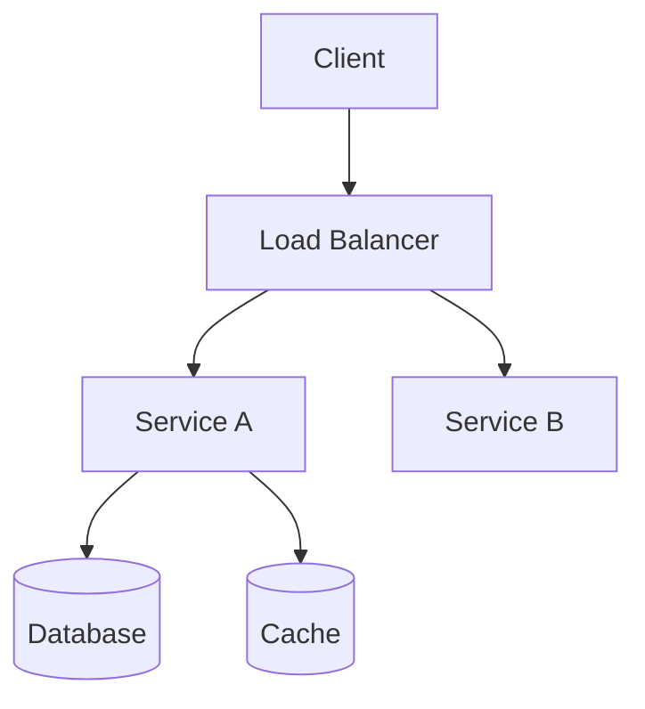
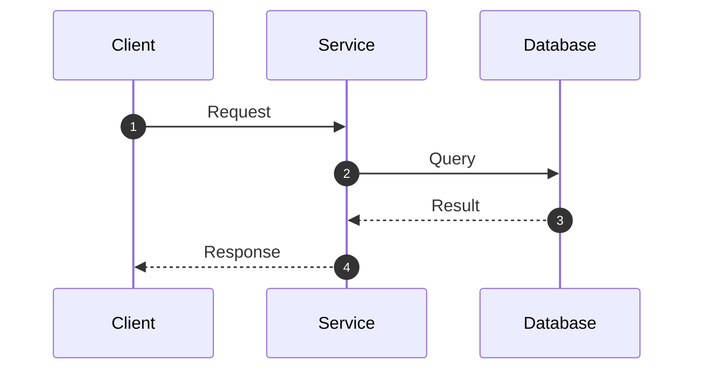
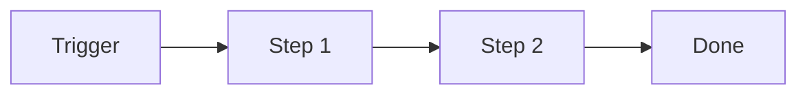

# Day XXX — Design: [Problem Name]

> Copy this file into your day folder as `design.md`. Fill in each section.  
> Reference: see `day-001-tiny-url/design.md` and `day-003-dropbox/design.md` for fully worked examples.

---

## 1. High-Level Architecture

```
Client
    |
    v
[CDN / WAF]
    |
    v
[Load Balancer]
    |
    +--> [Service A] ----> [Storage A]
    |
    +--> [Service B] ----> [Storage B]
```

_Draw your component boxes here. Label every arrow with what flows across it._

---

## 2. Core Services and Responsibilities

### [Service A Name]
- What it does
- What it reads from / writes to
- Key non-trivial decisions

### [Service B Name]
- What it does

_(Add one section per service you identify)_

---

## 3. Key Design Decision: [Most Important Decision]

**Options considered:**

| Option | Pros | Cons | Decision |
|--------|------|------|----------|
| Option 1 | | | |
| Option 2 | | | Yes/No |

**Decision:** _Why you chose what you chose._

_(Repeat for each major decision — typically 2–4 per system)_

---

## 4. Data Model

### Table / Collection: [name]

| Column / Field | Type | Notes |
|----------------|------|-------|
| id | UUID / VARCHAR | Primary key |
| ... | ... | ... |

**Indexes:**
- Primary key on `id`
- Index on `...` for query `...`

---

## 5. Request Flows

### [Core Flow Name] (e.g., Create / Read / Match / Upload)

1. Client sends `[METHOD] /endpoint`.
2. [Step 2]
3. [Step 3]
4. [Continue until response]

### [Second Core Flow]

1. ...

---

## 6. Caching Strategy

- **What to cache:** [cache key → cache value]
- **Cache technology:** Redis / Memcached / CDN
- **TTL:** [how long, and why]
- **Eviction / invalidation:** [how stale data is handled]
- **Failure handling:** [what happens when cache is unavailable]

---

## 7. Scalability Plan

### Read scaling
- [How you scale reads]

### Write scaling
- [How you scale writes]

### Storage growth
- [How storage evolves over time]

---

## 8. Reliability and Resilience

- **Replication:** [What is replicated and where]
- **Failover:** [How the system recovers from node failure]
- **Retries:** [Retry policy for downstream calls]
- **Circuit breaker:** [Which downstream calls are wrapped]
- **Dead-letter queue:** [What goes to DLQ and why]

---

## 9. Security

- [Authentication / authorization approach]
- [Input validation]
- [Sensitive data handling]
- [Rate limiting / abuse prevention]

---

## 10. SLOs and Key Metrics

**Latency targets:**
- [Operation A] P99 < ___ ms
- [Operation B] P99 < ___ ms

**Availability target:** 99.99%

**Key metrics to monitor:**
- Cache hit ratio
- [Operation A] error rate
- [Queue / batch] lag
- [Storage] capacity utilization

---

---

# Trade-offs Template

> Save this as `trade-offs.md` in your day folder.

## 1. Core Decisions

### Decision: [Title]

| Option | Pros | Cons | Decision |
|--------|------|------|----------|
| | | | |
| | | | Yes |

**Rationale:** _Why this option wins for your specific requirements._

_(Repeat for each major decision — match the ones in design.md)_

---

## 2. Secondary Trade-offs

- **[Trade-off topic]:** _What you chose and why._

---

## 3. Failure Modes and Mitigations

| Failure Mode | Impact | Mitigation |
|--------------|--------|------------|
| [Component X] unavailable | | |
| [Hot key / hot spot] | | |
| [Network partition] | | |
| [Data corruption] | | |

---

## 4. Migration Triggers (When to Re-architect)

- [Metric A] consistently exceeds [threshold]
- [Component B] becomes a bottleneck
- [New requirement C] emerges

_At that point, move to: [describe next architecture evolution]_

---

---

# Diagram Template

> Save this as `diagram.md` in your day folder.  
> Use Mermaid syntax — renders in GitHub and IntelliJ Markdown preview.

## 1. System Architecture



_Replace with your actual components. Use `TB` (top-bottom) for architecture, `LR` (left-right) for flows._

---

## 2. Primary Request Flow (Sequence)



_Add `alt` blocks for happy path vs error path._

---

## 3. [Secondary Flow or Background Job]


