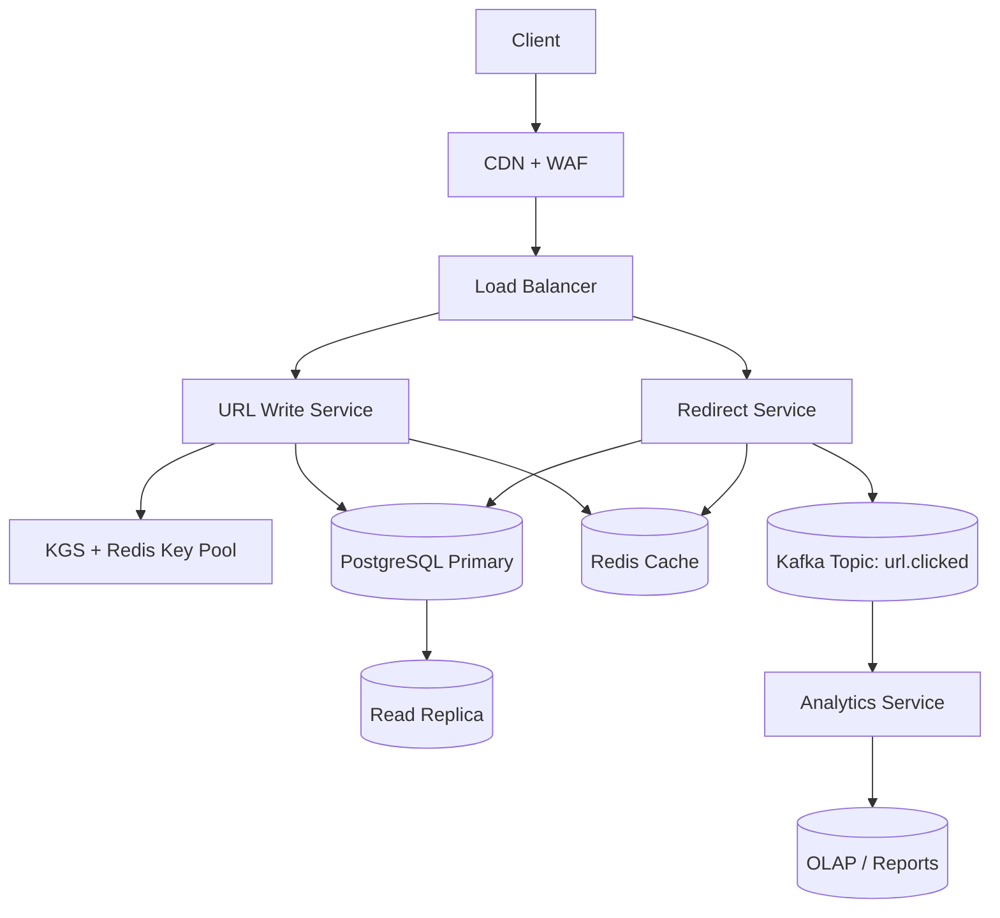
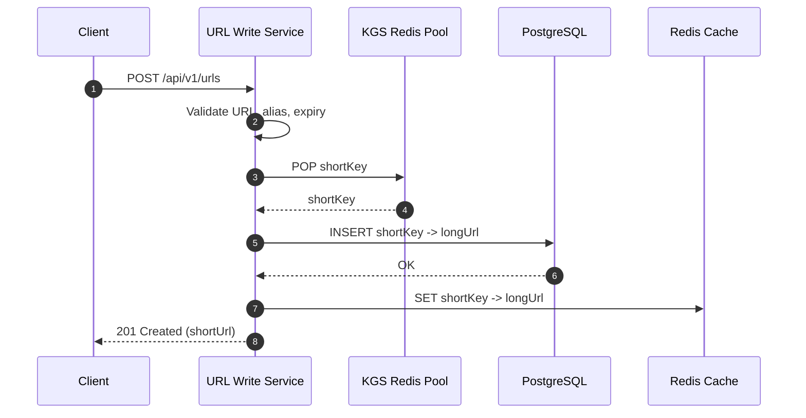
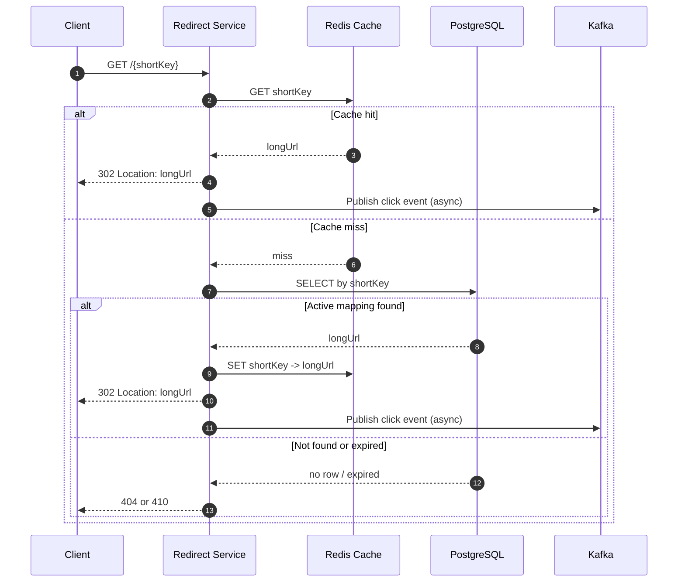
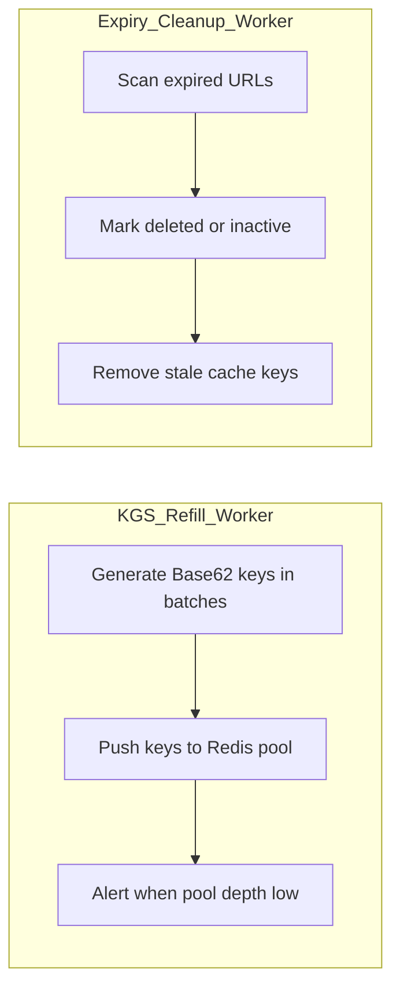

# Day 001 - Diagrams (TinyURL)

## 1. System Architecture

```mermaid
flowchart TB
  client[Client] --> waf[CDN + WAF]
  waf --> lb[Load Balancer]

  lb --> write[URL Write Service]
  lb --> redirect[Redirect Service]

  write --> kgs[KGS + Redis Key Pool]
  write --> pg[(PostgreSQL Primary)]
  write --> cache[(Redis Cache)]

  redirect --> cache
  redirect --> pg
  pg --> replica[(Read Replica)]

  redirect --> kafka[(Kafka Topic: url.clicked)]
  kafka --> analytics[Analytics Service]
  analytics --> olap[(OLAP / Reports)]
```

## 2. Create Flow (Sequence)

```mermaid
sequenceDiagram
  autonumber
  participant C as Client
  participant W as URL Write Service
  participant K as KGS Redis Pool
  participant P as PostgreSQL
  participant R as Redis Cache

  C->>W: POST /api/v1/urls
  W->>W: Validate URL, alias, expiry
  W->>K: POP shortKey
  K-->>W: shortKey
  W->>P: INSERT shortKey -> longUrl
  P-->>W: OK
  W->>R: SET shortKey -> longUrl
  W-->>C: 201 Created (shortUrl)
```

## 3. Redirect Flow (Sequence)

```mermaid
sequenceDiagram
  autonumber
  participant C as Client
  participant S as Redirect Service
  participant R as Redis Cache
  participant P as PostgreSQL
  participant K as Kafka

  C->>S: GET /{shortKey}
  S->>R: GET shortKey

  alt Cache hit
    R-->>S: longUrl
    S-->>C: 302 Location: longUrl
    S->>K: Publish click event (async)
  else Cache miss
    R-->>S: miss
    S->>P: SELECT by shortKey
    alt Active mapping found
      P-->>S: longUrl
      S->>R: SET shortKey -> longUrl
      S-->>C: 302 Location: longUrl
      S->>K: Publish click event (async)
    else Not found or expired
      P-->>S: no row / expired
      S-->>C: 404 or 410
    end
  end
```

## 4. Background Jobs

```mermaid
flowchart LR
  subgraph KGS_Refill_Worker
    g1[Generate Base62 keys in batches] --> g2[Push keys to Redis pool]
    g2 --> g3[Alert when pool depth low]
  end

  subgraph Expiry_Cleanup_Worker
    e1[Scan expired URLs] --> e2[Mark deleted or inactive]
    e2 --> e3[Remove stale cache keys]
  end
```
