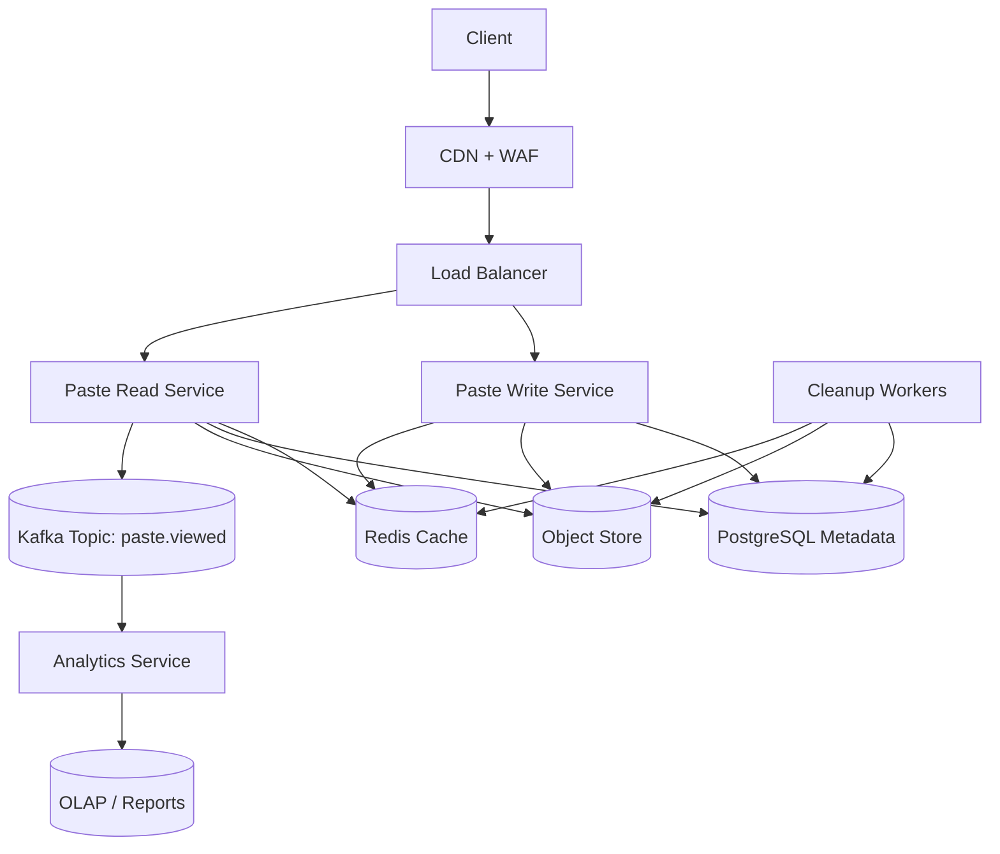
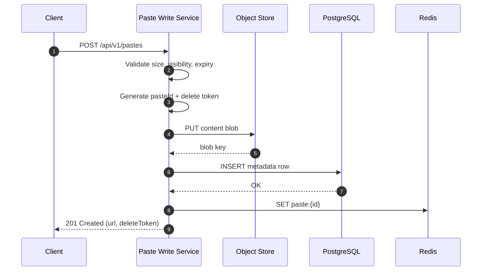
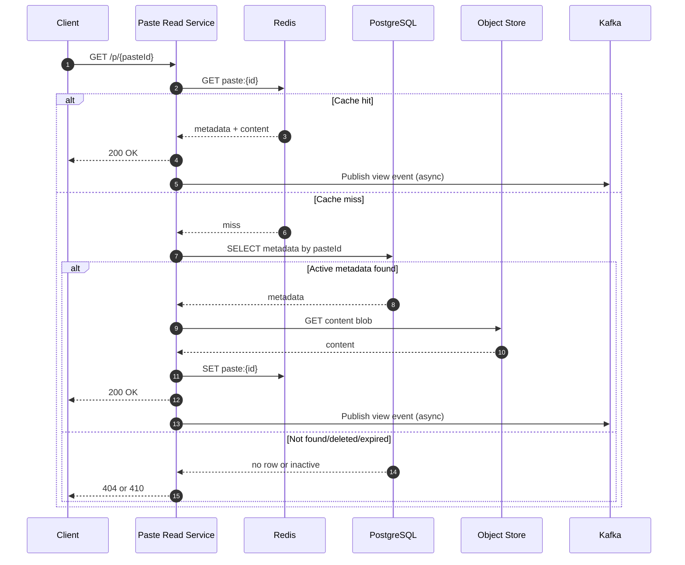

# Day 002 - Diagrams (File Sharing System / Pastebin)

## 1. System Architecture



## 2. Create Flow (Sequence)



## 3. Read Flow (Sequence)



## 4. Burn-After-Read Flow

```mermaid
flowchart LR
  readReq[GET /p/{id}] --> lock[Acquire short lock on pasteId]
  lock --> check{Already consumed?}
  check -- Yes --> gone[Return 410 Gone]
  check -- No --> serve[Serve content once]
  serve --> mark[Mark consumed/deleted]
  mark --> evict[Evict cache + schedule blob delete]
```
