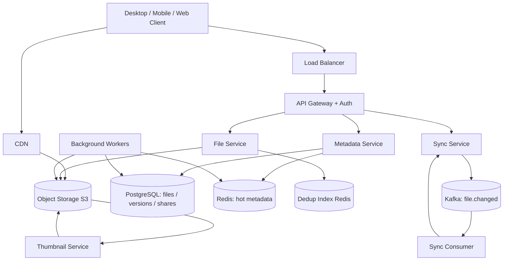
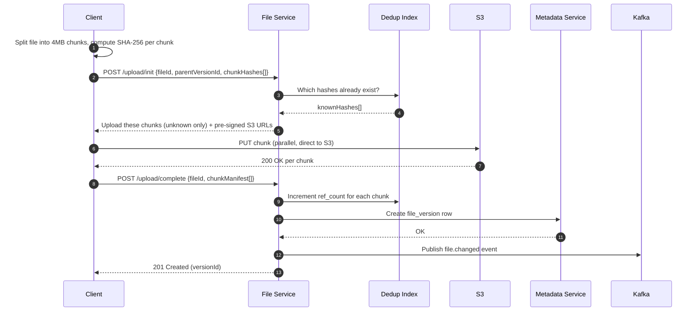
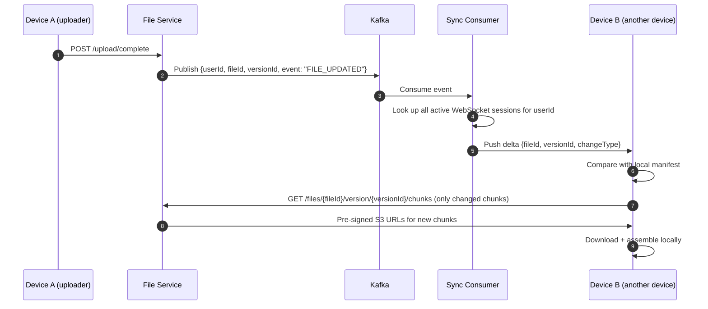
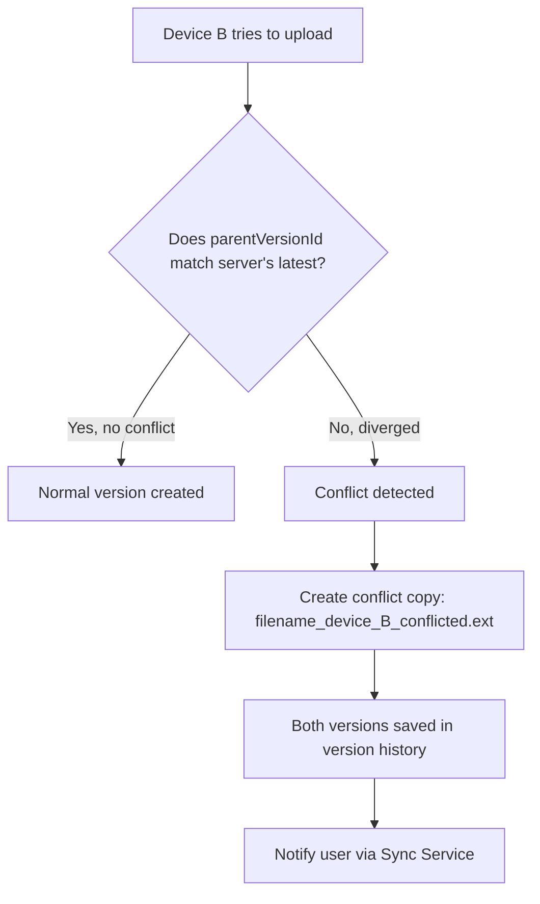
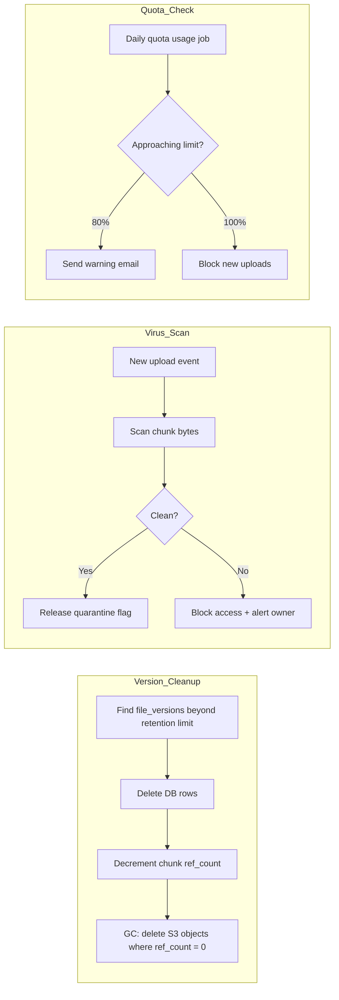

# Day 003 — Diagrams: Cloud Storage (Dropbox)

## 1. System Architecture

---

## 2. Chunked Upload Flow (Sequence)

---

## 3. Sync / Delta Delivery Flow (Sequence)

---

## 4. Conflict Detection and Resolution

---

## 5. Background Jobs

