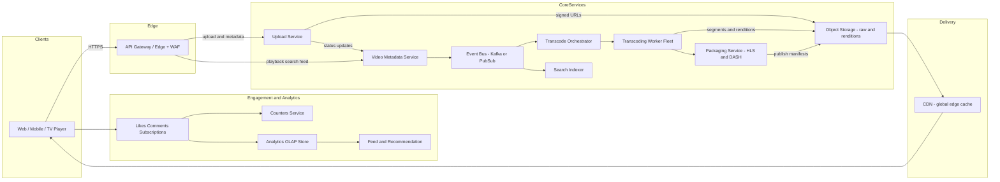
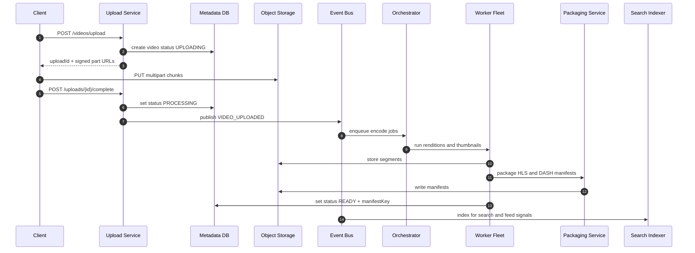
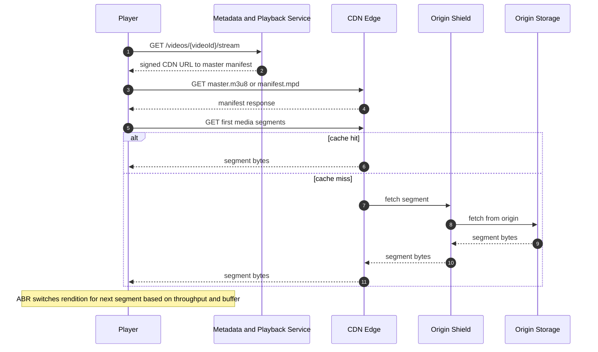
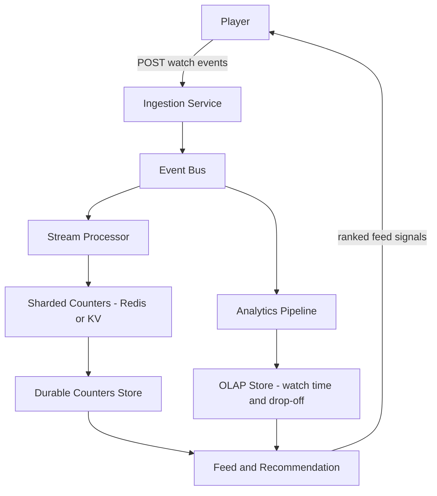

# Day 004 — Diagrams: Video Streaming (YouTube)

## 1) High-Level Architecture

---

## 2) Upload → Transcode → Publish Flow

---

## 3) Playback (ABR) Flow

---

## 4) View Counts + Analytics Flow

