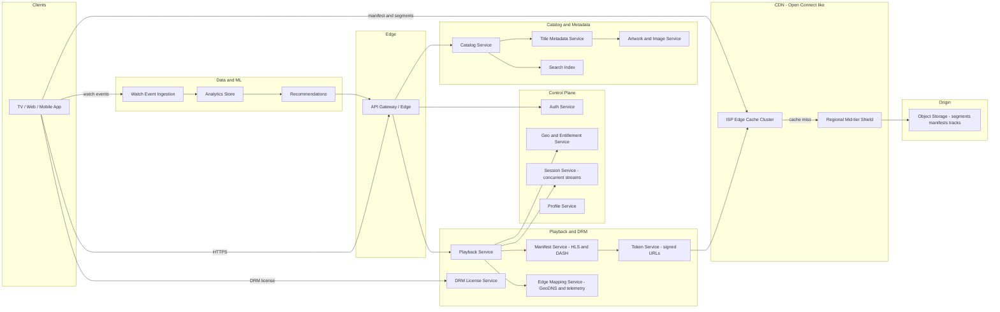
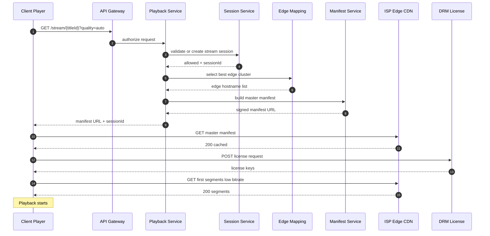
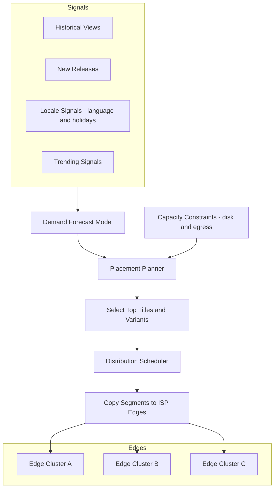
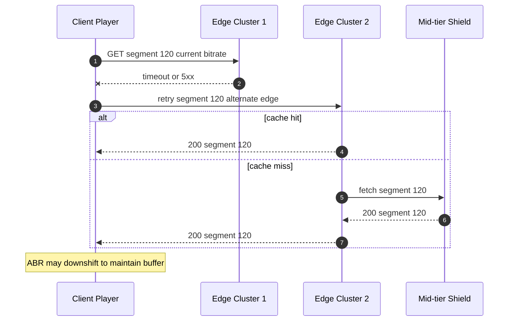

# Day 005 — Diagrams: Streaming Platform (Netflix)

---

## 1) High-Level Architecture

---

## 2) Playback Start Flow (under 2 seconds)

---

## 3) Content Pre-positioning (Nightly Push)

---

## 4) Failover Mid-Stream (Edge Down)

