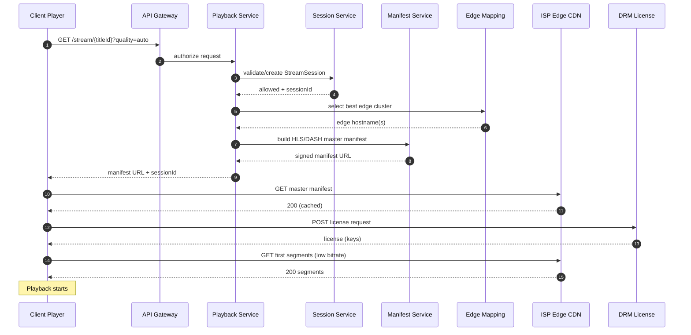
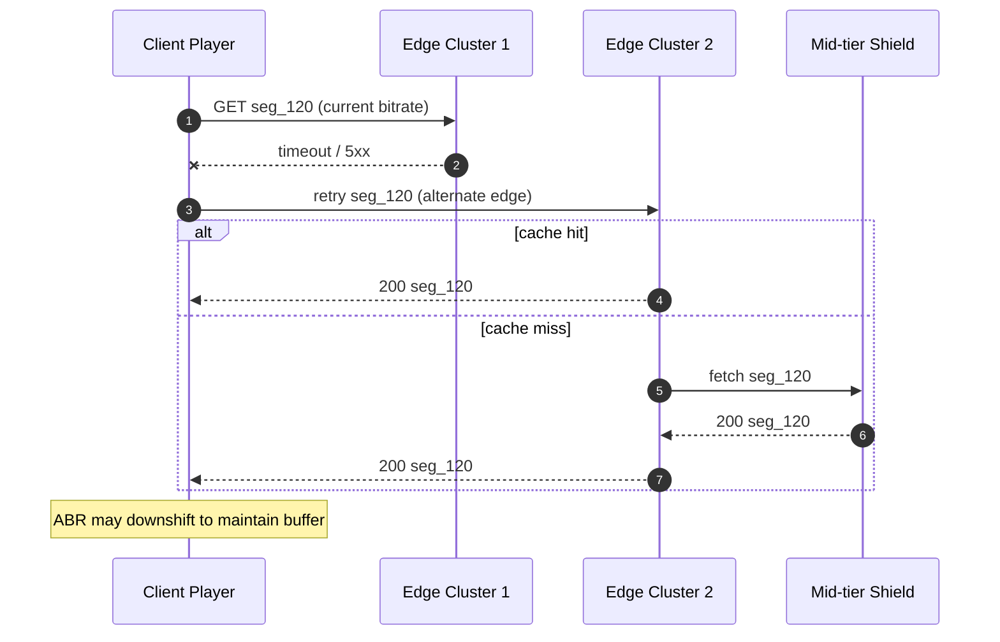

# diagram.md — Mermaid Architecture & Data Flow Diagrams

## 1) High-Level Architecture

```mermaid
flowchart LR
  subgraph Clients
    A[TV / Web / Mobile App]
  end

  subgraph Edge
    G[API Gateway / Edge]
  end

  subgraph ControlPlane[Control Plane]
    AUTH[Auth Service]
    GEO[Geo / Entitlement Service]
    SESS[Session Service<br/>(concurrent streams)]
    PROF[Profile Service]
  end

  subgraph MetadataPlane[Catalog & Metadata]
    CAT[Catalog Service]
    META[Title Metadata Service]
    IMG[Artwork/Image Service]
    SRCH[Search Index]
  end

  subgraph DeliveryPlane[Playback & DRM]
    PLAY[Playback Service]
    MAN[Manifest Service<br/>(HLS/DASH)]
    TOK[Token Service<br/>(signed URLs)]
    DRM[DRM License Service]
    MAP[Edge Mapping Service<br/>(GeoDNS/telemetry)]
  end

  subgraph CDN[CDN / Open Connect-like]
    EDGE1[ISP Edge Cache Cluster]
    MID[Regional Mid-tier / Shield]
  end

  subgraph Origin[Origin]
    OBJ[Object Storage<br/>(segments, manifests, tracks)]
  end

  subgraph DataPlane[Data / ML]
    EVT[Watch Event Ingestion]
    REC[Recommendations]
    OLAP[Analytics (OLAP)]
  end

  A -->|HTTPS| G
  G --> AUTH
  G --> CAT
  G --> PLAY

  CAT --> META
  CAT --> SRCH
  META --> IMG

  PLAY --> GEO
  PLAY --> SESS
  PLAY --> MAP
  PLAY --> MAN
  MAN --> TOK
  MAN --> EDGE1

  A -->|manifest + segments| EDGE1
  EDGE1 -->|miss| MID --> OBJ

  A -->|DRM license| DRM

  A -->|watch events| EVT --> OLAP
  OLAP --> REC
  REC --> G
```

---

## 2) Playback Start Flow (<2s)



---

## 3) Content Pre-positioning (Nightly Push)

```mermaid
flowchart TB
  subgraph Forecast
    H[Historical Views]
    N[New Releases]
    L[Locale Signals<br/>(language/holidays)]
    T[Trending Signals]
    F[Demand Forecast Model]
  end

  subgraph Planner
    P[Placement Planner]
    C[Capacity Constraints<br/>(edge disk/egress)]
    K[Select Top-K Titles + Variants]
  end

  subgraph Distribution
    D[Distribution Scheduler]
    X[Copy Segments to ISP Edges]
  end

  subgraph Edges
    E1[Edge Cluster A]
    E2[Edge Cluster B]
    E3[Edge Cluster C]
  end

  H-->F
  N-->F
  L-->F
  T-->F
  F-->P
  C-->P
  P-->K
  K-->D
  D-->X
  X-->E1
  X-->E2
  X-->E3
```

---

## 4) Failover Mid-Stream (Edge Down)



