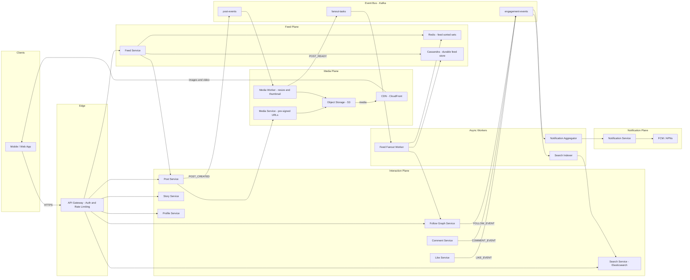
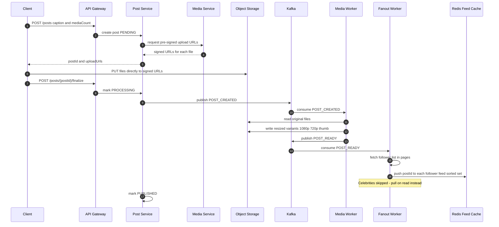
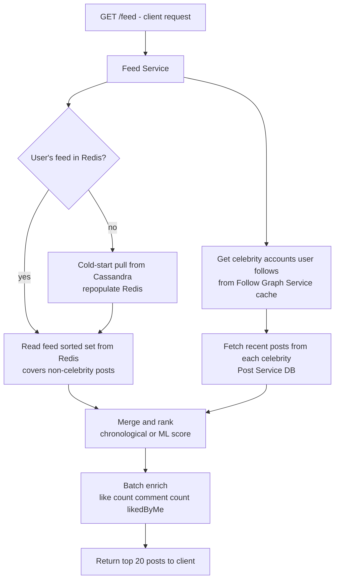
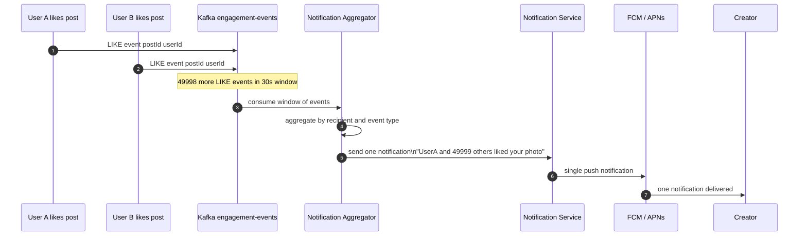
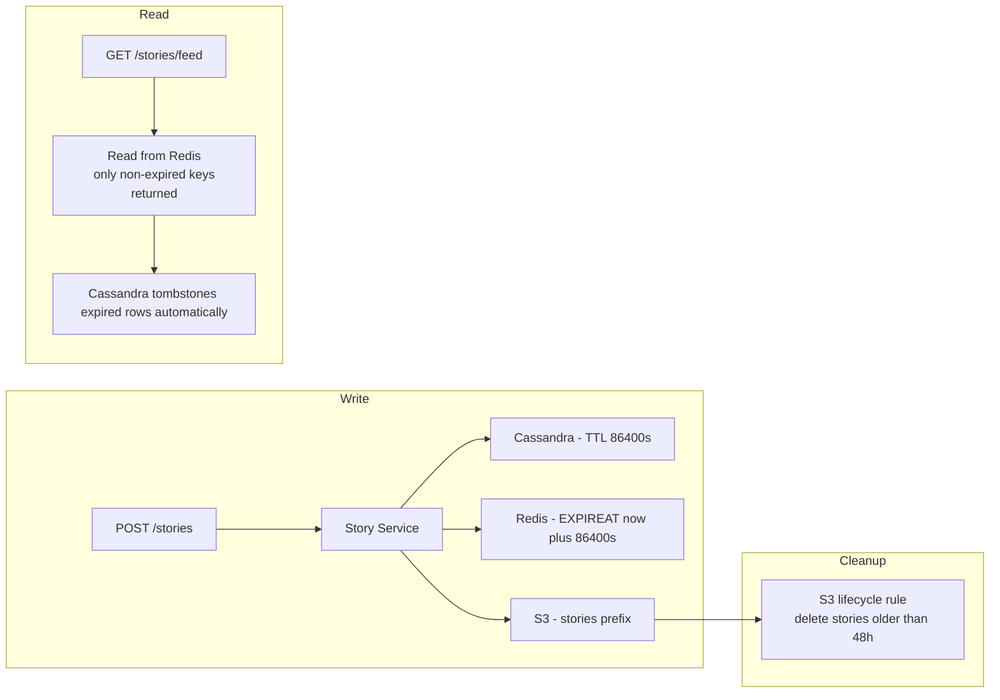

# Day 006 — Diagrams: Photo Feed & Social Network (Instagram)

## 1) High-Level Architecture

---

## 2) Post Upload Flow

---

## 3) Feed Read Flow (Hybrid Fan-out)

---

## 4) Notification Aggregation Flow

---

## 5) Story Expiry Strategy

