# Java Backend Engineering – Daily Revision Guide

**Purpose:** Turn 61 first-round interview Q&As into a **story-driven, daily revision** you can read to get better at Java backend, HLD, and LLD. Each section has a short “why it matters” story, the questions, concise answers, and **technical diagrams** (Mermaid) for HLD/LLD.

---

## How to Use This Guide

| Mode | How |
|------|-----|
| **Daily revision** | Read **one section per day** (e.g., Day 1 = Core Java concurrency). Re-read the story, then scan Q&A and diagrams. |
| **Interview prep** | Use the **question list** at the start of each section; answer aloud, then check the cheat sheet and diagrams. |
| **HLD/LLD focus** | Focus on the **Mermaid diagrams** in each section; redraw them on paper to internalize flows and layers. |

### 12-Day Reading Plan (by topic)

| Day | Section | Questions |
|-----|---------|-----------|
| 1 | Core Java (11/17) | 1–8 |
| 2 | Spring & Spring Boot | 9–16 |
| 3 | Microservices & Messaging | 17–22 |
| 4 | Databases (SQL & NoSQL) | 23–28 |
| 5 | Testing & Quality | 29–31 |
| 6 | Performance & Reliability | 32–34 |
| 7 | CI/CD, Git, Containers, Cloud | 35–40 |
| 8 | Security & Infosec | 41–48 |
| 9 | Observability | 49–51 |
| 10 | Collaboration & Practices | 52–54 |
| 11–12 | Resume Deep-Dive | 55–61 |

---

## Day 1 – Core Java (11/17)

### Story behind the topic

In production, a Java backend handles many requests at once. **Threads, memory, and data structures** decide whether the app stays fast and stable or hits race conditions, deadlocks, or GC pauses. Understanding **Thread vs Runnable vs Callable**, **HashMap internals**, **Streams**, and **JVM/GC** is the foundation for writing correct, performant code and debugging outages.

---

### Q1) Thread vs Runnable vs Callable – differences and use-cases?

**Short answer:**  
`Thread` is the unit that executes code. `Runnable` provides `run()` with no return value. `Callable` provides `call()` that returns a value and can throw checked exceptions. Use **Callable** with `ExecutorService.submit()` when you need results, timeouts, or cancellation (e.g., calling an external API and waiting for a response).

**Use-cases:**  
- **Runnable:** fire-and-forget tasks (logging, metrics).  
- **Callable:** anything where you need the result (DB call, HTTP call) or timeouts.

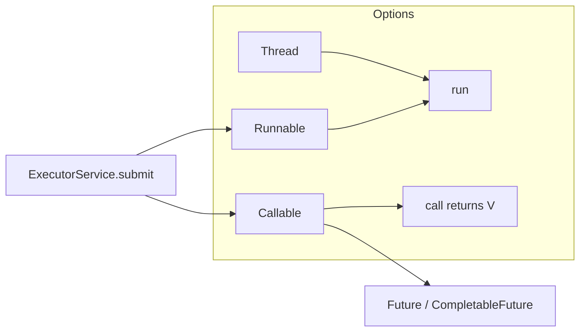

---

### Q2) ExecutorService vs ForkJoinPool; where to use CompletableFuture?

**Short answer:**  
- **ExecutorService:** general-purpose thread pools (fixed/cached); use for I/O-bound or mixed workloads (REST calls, DB).  
- **ForkJoinPool:** work-stealing for **divide-and-conquer** (e.g., parallel streams, recursive tasks); good when work can be split into smaller chunks.  
- **CompletableFuture:** for **async composition** and non-blocking callbacks (chain `thenApply`, `thenCompose`, `allOf`); use when coordinating multiple async calls without blocking threads.

**When to use:**  
- ExecutorService → most backend tasks (HTTP, DB).  
- ForkJoinPool → CPU-bound parallel algorithms or `parallelStream()`.  
- CompletableFuture → “call A, then B, then combine” without blocking.

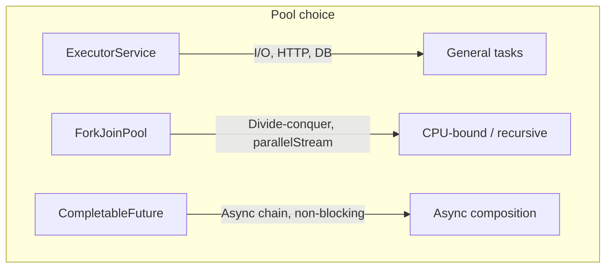

---

### Q3) Race condition vs deadlock; patterns to avoid them?

**Short answer:**  
- **Race condition:** two or more threads access **shared mutable state** without proper synchronization; result depends on timing.  
- **Deadlock:** threads wait on each other in a **cycle** (e.g., T1 holds L1, wants L2; T2 holds L2, wants L1).  

**Avoidance:**  
- **Race:** immutability, thread confinement, `synchronized`/locks, atomic classes.  
- **Deadlock:** lock ordering (always acquire in same order), timeouts, `tryLock`, avoid holding multiple locks when possible.

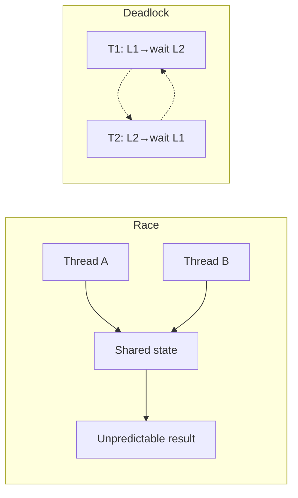

---

### Q4) HashMap internals; impact of equals/hashCode?

**Short answer:**  
HashMap: **hash → bucket index →** in each bucket, a **list** (or **tree** if many collisions). Poor `hashCode` or inconsistent `equals`/`hashCode` cause **many collisions** and degrade to O(n) lookups. Keys must be immutable (or not mutated after put) and `equals`/`hashCode` must be **consistent** (same fields, same contract).

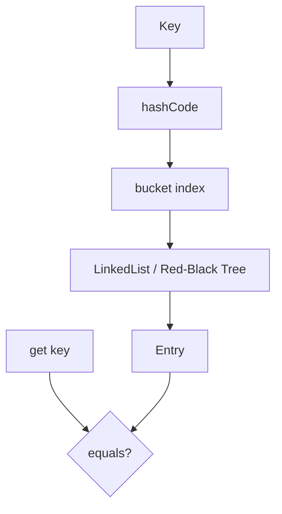

---

### Q5) Streams vs loops; pitfalls of parallel streams?

**Short answer:**  
Streams are concise, composable, and can use **parallelStream()** for parallelism. Pitfalls: **stateful lambdas**, **side effects** in lambdas, **unordered** assumptions in parallel ops. Prefer stateless lambdas, simple terminal ops, and well-defined collectors. Use parallel streams only when the workload is large enough and thread-safe.

---

### Q6) JVM memory model & GC basics; finding leaks?

**Short answer:**  
- **Heap:** young (Eden + Survivors) and old generation; **Metaspace:** class metadata.  
- **Stack:** per-thread frames.  
- **GC:** G1 (default in many setups), ZGC for low latency.  
- **Leaks:** objects still reachable (e.g., static caches, listeners not removed). **Find:** heap dumps, Eclipse MAT/VisualVM, profilers; look for growing old gen and dominant roots (static refs, thread locals).

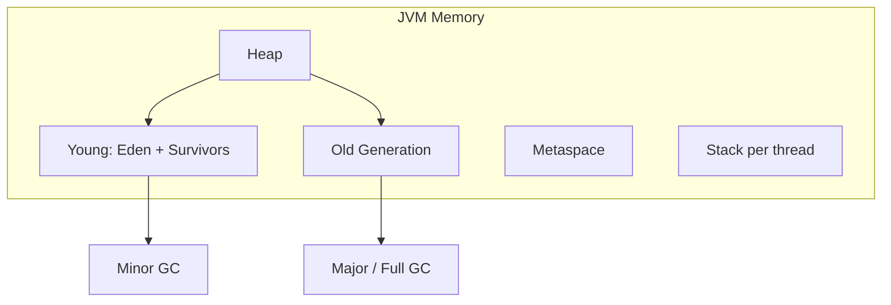

---

### Q7) Benefits of immutability; how to implement?

**Short answer:**  
Immutability gives **thread safety** without locking, safe sharing, and cache-friendly behavior. Implement: **final** fields, no setters, **defensive copy** for mutable inputs/outputs, and don’t allow subclasses to break it (final class or factory).

---

### Q8) Newer Java features (var, records, switch) and why?

**Short answer:**  
- **var:** less verbosity when type is obvious; keep readability.  
- **records:** compact **immutable data carriers** (equals, hashCode, getters generated).  
- **Switch expressions/patterns:** clearer branching and exhaustiveness. Use for readability, less boilerplate, and fewer bugs.

---

## Day 2 – Spring & Spring Boot

### Story behind the topic

Spring is the **backbone** of most Java backends: it wires components (**DI**), exposes **REST APIs**, talks to **DBs** and **caches**, and handles **security** and **observability**. Knowing how **beans**, **transactions**, **filter chains**, and **Actuator** work is essential for both implementing features and debugging production issues.

---

### Q9) How DI works; bean scopes; @ConfigurationProperties vs @Value?

**Short answer:**  
**DI:** container creates and injects **beans** (dependencies) into constructors/fields/setters. **Scopes:** singleton (default), prototype (new each time), request/session (web). **@ConfigurationProperties** binds **hierarchical** config (nested objects, validation, type-safe); **@Value** for **single** values (e.g., `"${app.name}"`). Prefer `@ConfigurationProperties` for structured config.

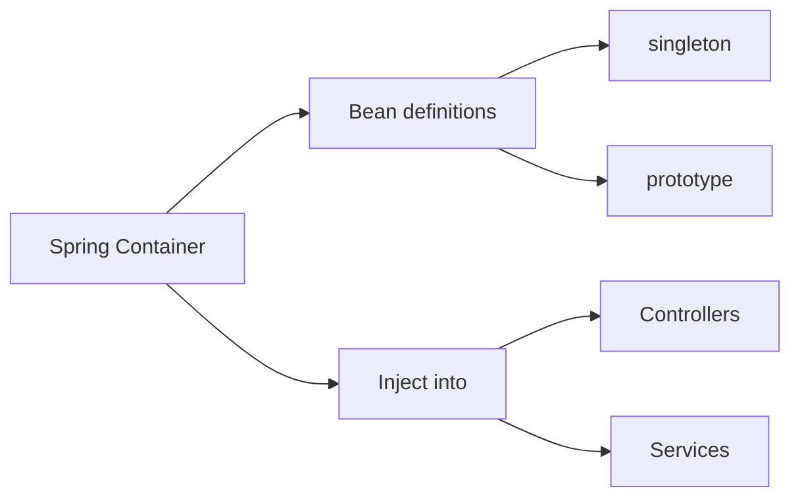

---

### Q10) Build a REST controller with validation + global exception handling?

**Short answer:**  
Use **@RestController**, **DTOs** with **Bean Validation** (`@Valid`), and **@ControllerAdvice** + **@ExceptionHandler** for global errors. Return consistent payloads (e.g., **RFC 7807 Problem Details**): status, title, detail, correlation ID.

---

### Q11) Spring Data JPA – paging/sorting; N+1 problem and fixes?

**Short answer:**  
Use **PagingAndSortingRepository** / **Pageable** for paging and sorting. **N+1:** one query for parent, N for children. **Fixes:** **fetch join**, **@EntityGraph**, **batch size** (`@BatchSize`), or **DTO/projection** to load only needed fields.

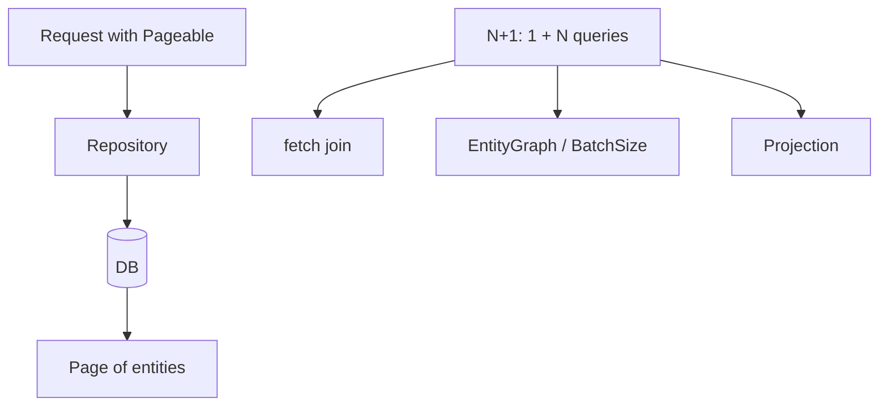

---

### Q12) Transactions – propagation/isolation; optimistic vs pessimistic locking?

**Short answer:**  
- **Propagation:** e.g. **REQUIRED** (join existing or create), **REQUIRES_NEW** (new transaction).  
- **Isolation:** read committed, repeatable read, serializable (controls dirty/non-repeatable/phantom reads).  
- **Optimistic:** version field; retry on conflict. **Pessimistic:** `SELECT ... FOR UPDATE`; lock row. Choose by contention and consistency needs.

---

### Q13) Caching with @Cacheable (Redis) and invalidation strategies?

**Short answer:**  
Use **@Cacheable** (and **@CacheEvict** / **@CachePut**) with a Redis cache manager. Set **TTL**, **versioned keys** (e.g., `cache:v2:user:id`), and **invalidate on writes**. Mitigate **cache stampede** (e.g., coalescing) and **hot keys** (sharding, local cache).

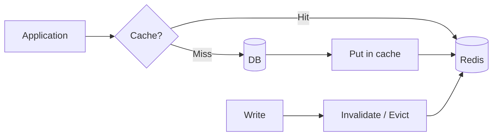

---

### Q14) Spring Security – filter chain, method vs URL security, password storage?

**Short answer:**  
**DelegatingFilterProxy** delegates to a **filter chain** (auth, authZ, session, etc.). **Method security:** `@PreAuthorize` / `@PostAuthorize` for fine-grained rules; **URL security:** `authorizeRequests()` (or equivalent) for path-based rules. **Passwords:** **bcrypt** or **Argon2**; never plaintext. For APIs, use **resource server** with JWT validation.

```mermaid
flowchart TB
  Request[Request] --> F1[SecurityContextPersistence]
  F1 --> F2[Auth (e.g. JWT)]
  F2 --> F3[Authorization]
  F3 --> F4[FilterSecurityInterceptor]
  F4 --> App[Application]
```

---

### Q15) Spring Boot Actuator – health/metrics; securing endpoints?

**Short answer:**  
**/health**, **/metrics**, **/info** (and others) for observability. **Secure:** separate **management port**, **auth** for sensitive endpoints, **expose** only what’s needed (e.g., not all metrics in public). Use **health groups** to hide details from public health checks.

---

### Q16) Unit vs integration tests; when to use Testcontainers?

**Short answer:**  
**Unit:** isolate with mocks; fast; test one class. **Integration:** real DB, Kafka, etc.; use **Testcontainers** for DB/Kafka in tests. Use **@SpringBootTest** or **slices** (`@DataJpaTest`, `@WebMvcTest`) as needed. Testcontainers when you need real compatibility (e.g., PostgreSQL, Kafka) without shared external services.

---

## Day 3 – Microservices & Messaging

### Story behind the topic

Backends are rarely a single monolith. **Microservices** communicate via **REST** or **gRPC** and **events** (e.g., **Kafka**). You need to design for **resilience** (retries, timeouts, circuit breakers), **idempotency**, **exactly-once** semantics, and **event evolution** so that the system stays reliable and maintainable at scale.

---

### Q17) REST vs gRPC – trade-offs?

**Short answer:**  
**REST:** human-readable, HTTP/JSON, wide client support, caching. **gRPC:** binary (**protobuf**), **HTTP/2**, streaming, strong typing, less overhead. Choose by **client ecosystem** and **latency/throughput** needs; gRPC for service-to-service, REST for public or web/mobile.

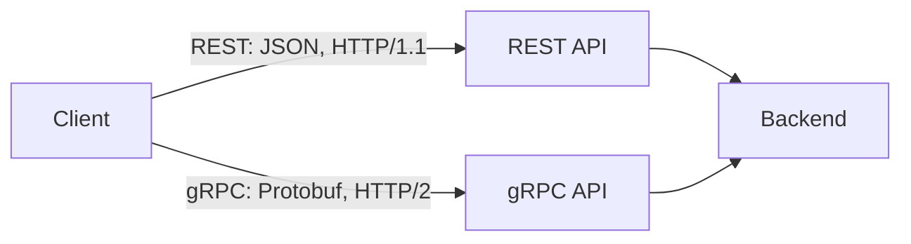

---

### Q18) Designing idempotent APIs; retry/timeout/circuit breaker (Resilience4j)?

**Short answer:**  
**Idempotency:** client sends **idempotency key**; server deduplicates and returns same result for same key. **Retry:** exponential backoff, finite attempts. **Timeout:** bound every external call. **Circuit breaker:** open after N failures; fail fast; half-open to test recovery. **Resilience4j** provides these patterns in Java.

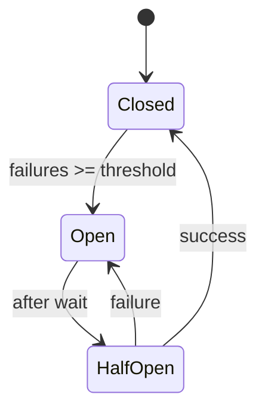

---

### Q19) Kafka basics – topics, partitions, consumer groups, offsets?

**Short answer:**  
**Topic:** stream of records. **Partitions:** parallelism; order within partition. **Consumer group:** group of consumers **sharing** partitions (each partition consumed by one consumer in the group). **Offsets:** per-partition position; committed to track progress. **Rebalance** when consumers join/leave.

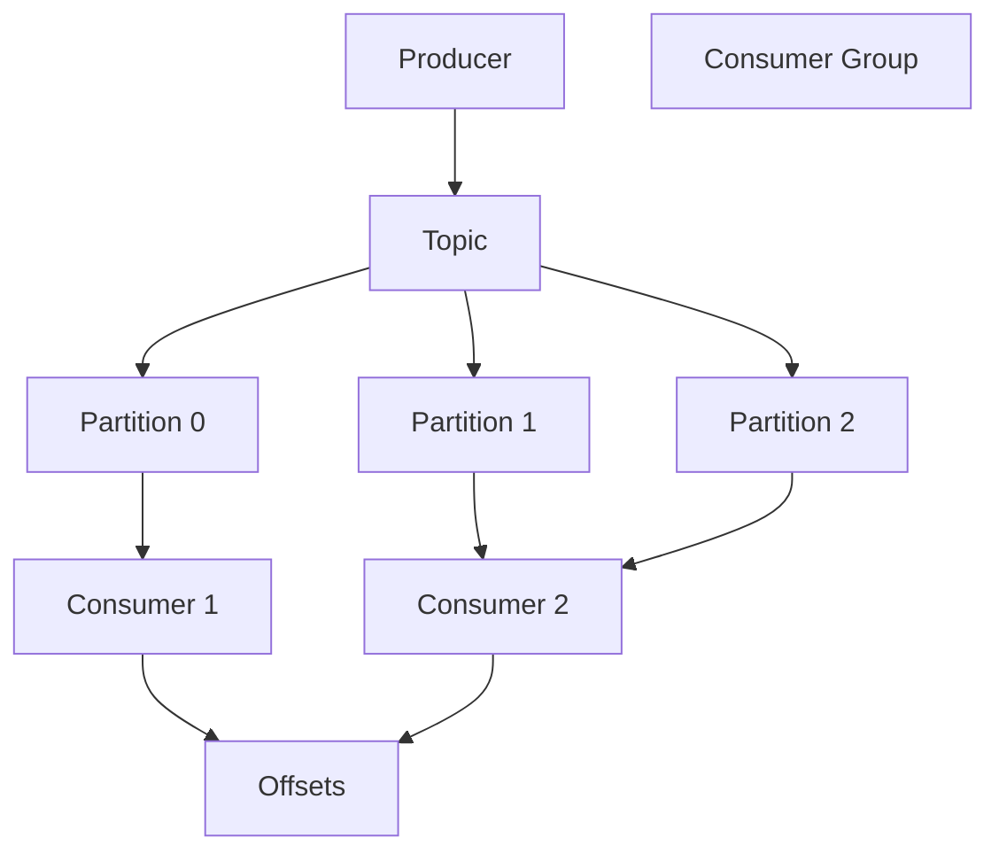

---

### Q20) Exactly-once vs at-least-once; dedup (outbox, idempotency keys)?

**Short answer:**  
**Exactly-once:** idempotent producer + transactional consumer, or **outbox** (write event to DB in same tx as business data; relay publishes). **At-least-once:** common default; use **idempotency keys** and **dedupe** in consumers (e.g., by key in DB or cache).

---

### Q21) Event schema evolution (Avro/Schema Registry) & compatibility?

**Short answer:**  
Use **Avro** (or similar) with **Schema Registry**. Prefer **backward-compatible** changes (e.g., add optional fields, avoid removing required fields). Registry enforces compatibility; consumers can evolve without breaking producers.

---

### Q22) Saga – choreography vs orchestration; eventual consistency?

**Short answer:**  
**Saga:** distributed transaction made of local steps + **compensating actions**. **Choreography:** each service reacts to events and publishes its own; no central coordinator. **Orchestration:** central coordinator calls services and drives compensations. Accept **eventual consistency** and design for rollback and retries.

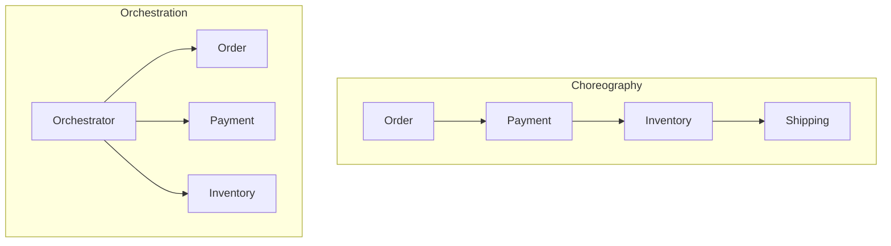

---

## Day 4 – Databases (SQL & NoSQL)

### Story behind the topic

**Data layer** choices (SQL vs Mongo vs Redis) and **indexing**, **query tuning**, and **caching** directly affect correctness, latency, and scalability. Good backend engineers know when to use which store, how to avoid slow queries, and how to design caches and migrations.

---

### Q23) Choosing SQL vs NoSQL (Mongo/Redis) – when and why?

**Short answer:**  
**SQL:** relational integrity, joins, ACID, complex queries. **Mongo:** flexible schema, document model, scale-out reads. **Redis:** ephemeral cache, counters, sessions, pub/sub. Choose by **access patterns**, consistency needs, and operational constraints.

---

### Q24) Indexing strategies; when indexes hurt writes?

**Short answer:**  
Index **selective** columns used in WHERE/JOIN/ORDER. **Composite** indexes follow **leftmost prefix**. Too many indexes **hurt writes** (every insert/update maintains indexes); balance read vs write load.

---

### Q25) Query optimization – EXPLAIN; diagnosing slow queries?

**Short answer:**  
Use **EXPLAIN** / **EXPLAIN ANALYZE** to see plan and actual cost. Fix with: right **indexes**, rewriting **joins**, **LIMIT**/pagination, **denormalization** where justified. Monitor slow-query log and APM.

---

### Q26) ACID & isolation levels; phantom reads?

**Short answer:**  
**ACID:** Atomicity, Consistency, Isolation, Durability. **Isolation levels** control **dirty**, **non-repeatable**, and **phantom** reads. Phantom read: same query returns new rows in another transaction. Choose isolation per use-case (e.g., read committed vs serializable).

---

### Q27) Redis cache design – TTL, eviction, hot keys?

**Short answer:**  
Set **TTL** to avoid stale data and unbounded growth. **Eviction:** LRU/LFU as needed. **Hot keys:** shard (key hashing), local cache in front, or split key (e.g., by user id). Use **cache-aside** (or write-through) consistently.

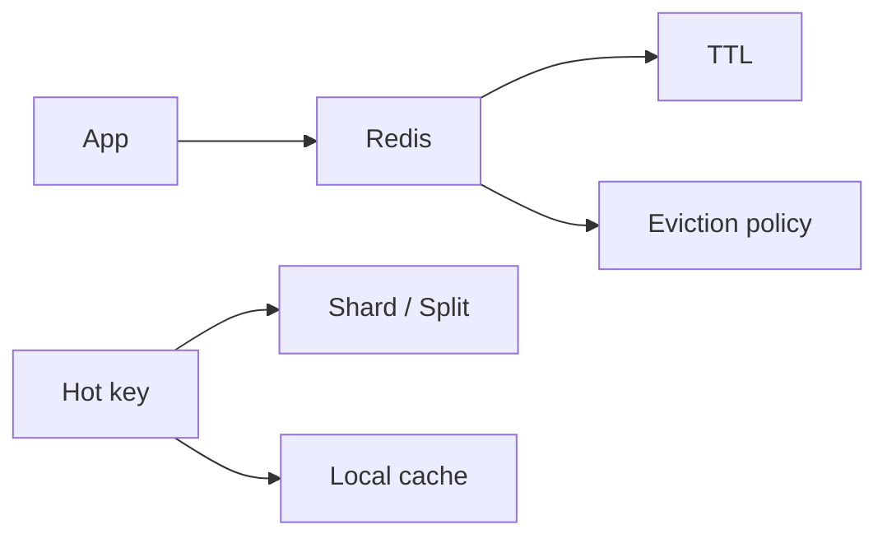

---

### Q28) Modeling in Mongo – embed vs reference; migrations?

**Short answer:**  
**Embed** when data is accessed together and bounded (e.g., line items in order). **Reference** when shared or growing (e.g., user ref in many orders). **Migrations:** versioned scripts, backfills, dual-write then cutover where needed.

---

## Day 5 – Testing & Quality

### Story behind the topic

**Tests** protect refactors and catch regressions. The **test pyramid** (more unit, fewer integration, few E2E) and **contract tests** keep quality high without slowing feedback. Fixing **flaky** tests and using **Testcontainers** for integration tests are part of daily backend work.

---

### Q29) Test pyramid; where do contract tests fit?

**Short answer:**  
**Pyramid:** many **unit** tests, fewer **integration**, few **E2E**. **Contract tests** validate **inter-service** APIs (consumer-driven or provider-driven); they sit between unit and integration, ensuring API compatibility without full deployment.

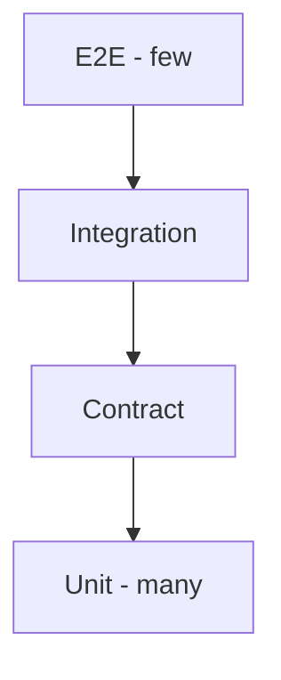

---

### Q30) Example of a flaky test you fixed (JUnit/Mockito tips)?

**Short answer:**  
Stabilize by: removing **Thread.sleep** (use **Awaitility** or latches), fixing **shared mutable state**, using **deterministic** test data and clocks, and injecting **seams** for time/IO. In Mockito: **verify** interactions, **capture** arguments, use **@Mock** and **@InjectMocks** clearly.

---

### Q31) Integration tests across DB and Kafka?

**Short answer:**  
Use **Testcontainers** for **PostgreSQL** (or same DB as prod) and **Kafka**; start containers in test lifecycle. Run consumer/producer tests against the container; assert on DB state and consumed messages. Keep tests isolated (clean DB, dedicated topics/prefixes).

---

## Day 6 – Performance & Reliability

### Story behind the topic

**Latency** and **throughput** issues show up in production. Knowing how to **profile** (e.g., Flight Recorder, async-profiler), size **thread pools**, and when **caching** helps or hurts **consistency** is key to making systems fast and correct.

---

### Q32) Finding/fixing a latency bottleneck – tools and approach?

**Short answer:**  
**Reproduce** with load tests; **profile** (JFR, async-profiler, APM). Fix **hotspots:** add indexes, caching, batching, connection pooling, pool tuning. Measure before/after (latency percentiles, throughput).

---

### Q33) Thread-pool sizing for blocking vs non-blocking workloads?

**Short answer:**  
**Blocking (I/O):** `threads ≈ cores * (1 + wait/compute)` (e.g., wait 90% → 10x cores). **Non-blocking/reactive:** small pool, often **~cores**; threads don’t block on I/O. Oversized pools can hurt (context switch, memory).

---

### Q34) When caching hurts consistency; mitigation?

**Short answer:**  
Caching can cause **stale reads** and **write loss** if not invalidated. **Mitigate:** invalidate on write, **short TTLs**, **write-through** or **event-driven** cache updates, and accept eventual consistency where appropriate.

---

## Day 7 – CI/CD, Git, Containers, Cloud

### Story behind the topic

**CI/CD**, **Git** workflow, **Docker**, and **cloud** primitives are part of the backend engineer’s job. You’re expected to know branching strategies, pipeline stages, image hardening, and basic K8s/cloud concepts for HLD discussions.

---

### Q35) Preferred Git branching strategy; merge vs rebase?

**Short answer:**  
**Trunk-based:** short-lived branches, frequent merge to main. **GitFlow:** develop + release branches for versioned releases. **Rebase** for linear history; **merge** for audit trail. Enforce **PR checks** and branch protection.

---

### Q36) CI pipeline stages (build, test, SAST, artifact, deploy)?

**Short answer:**  
Typical stages: **build** → **unit tests** → **SAST** → **integration tests** → **artifact** (versioned) → **deploy** (to env). **Gates:** quality (coverage), security (no critical/high), and approval for production.


---

### Q37) Maven vs Gradle – trade-offs; dependency convergence?

**Short answer:**  
**Maven:** convention, stability, XML. **Gradlew:** performance, flexibility, Groovy/Kotlin DSL. **Convergence:** use **BOMs** and **dependencyManagement** to align versions and avoid conflicts.

---

### Q38) Docker image hardening – multi-stage, non-root, minimal base?

**Short answer:**  
**Multi-stage** to keep final image small and free of build tools. Run as **non-root**. **Minimal base:** distroless or Alpine. **Pin** image digests; **scan** for vulnerabilities. No secrets in image.

---

### Q39) K8s basics – Deployment vs StatefulSet; Service; probes?

**Short answer:**  
**Deployment:** stateless apps; rolling updates. **StatefulSet:** stable identity and storage (e.g., Kafka, DB). **Service:** stable network to pods. **Probes:** **readiness** (traffic only when ready), **liveness** (restart when unhealthy). Use **ConfigMap**/ **Secret** for config.

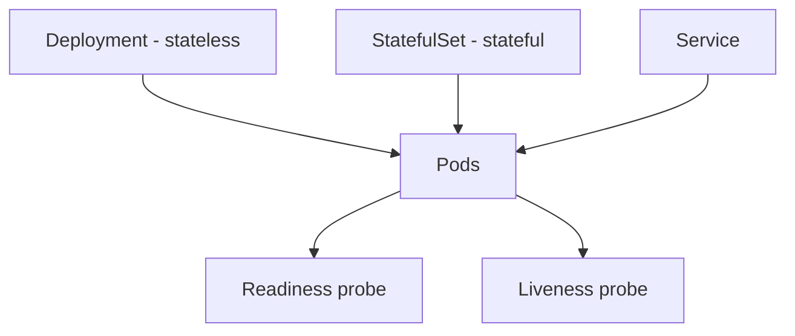

---

### Q40) Cloud primitives used on AWS/Azure and why?

**Short answer:**  
Use **EC2/Lambda**, **RDS**, **S3**, **VPC**, IAM (or Azure equivalents) based on workload. **Secrets** in vault/Secret Manager. Right-size, autoscale, and use spot where appropriate for cost and reliability.

---

## Day 8 – Security & Infosec

### Story behind the topic

**OAuth2/OIDC**, **JWT**, **secrets management**, **vulnerability** handling, and **EOL** tracking are part of secure backend design and compliance. Interviewers probe both concepts and how you applied them in real projects.

---

### Q41) OAuth2 flows; where OIDC adds value; JWT structure & best practices?

**Short answer:**  
**OAuth2:** authorization (e.g., authorization code, client credentials). **OIDC:** identity layer (ID token, user info). **JWT:** header.payload.signature; **best practices:** short TTL, key rotation (**kid**), validate **audience** and **scope**, secure algorithm (e.g., RS256).

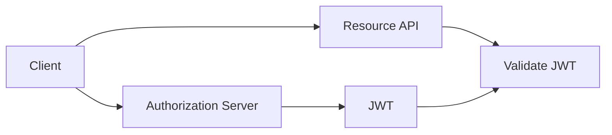

---

### Q42–48) Token expiry, secrets, stale keys, collaborators, vuln management, EOL, dependencies

**Short answers (concise):**  
- **42:** Fine-grained PATs with ≤30d expiry; rotate via automation; revoke unused per audit.  
- **43:** Scan with secret scanning / Gitleaks / TruffleHog; remove, rotate, move to vault/env.  
- **44:** Stale = unused for N days; detect from logs; revoke and notify.  
- **45:** Review outside collaborators; least privilege; auto-expire; audit and remove.  
- **46:** Scan continuously; prioritize Critical/High; patch within SLA; track exceptions.  
- **47:** Inventory/SBOM; check vendor lifecycle; plan upgrades before EOL.  
- **48:** Dependabot/Snyk; SBOM; test upgrades; pin versions; monitor CVEs.

---

## Day 9 – Observability

### Story behind the topic

**Logging**, **metrics**, and **tracing** help you debug production and meet SLOs. Structured logs with **correlation IDs**, **Prometheus/Grafana** for latency and errors, and **distributed tracing** (e.g., OpenTelemetry) are standard expectations.

---

### Q49) Structured logging & correlation IDs (ELK)?

**Short answer:**  
Emit **JSON** logs with **requestId**/ **correlationId**; use levels appropriately. Ship to **ELK** (or similar); search and trace requests across services by correlation ID.

---

### Q50) Backend SLOs/metrics (latency/throughput/errors) and Prometheus/Grafana?

**Short answer:**  
Track **p95 latency**, **RPS**, **error rate**, **saturation**. **Prometheus** scrapes; **Grafana** dashboards and **alerts**. Define SLOs (e.g., 99.9% availability, p95 < 200ms) and alert on error budget burn.

---

### Q51) Distributed tracing – when it helped debug prod?

**Short answer:**  
Use **OpenTelemetry** (or similar); traces show **cross-service** latency and call graph. Use when debugging slow or failing requests across multiple services; narrow down to the slow **span** and fix (e.g., slow DB, external API).

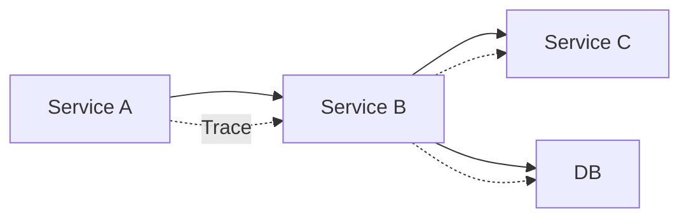

---

## Day 10 – Collaboration & Practices

### Story behind the topic

**Code review**, **DevOps** collaboration (deploy/rollback), and **slicing features** for delivery under ambiguity show how you work in a team and deliver value incrementally.

---

### Q52) What do you look for in a code review?

**Short answer:**  
Correctness, **security** (injection, auth), **performance** (N+1, big allocations), **readability** and maintainability. Prefer **small PRs** and **tests**; comment constructively.

---

### Q53) Working model with DevOps during deploy/rollback?

**Short answer:**  
Pre-deploy **checklists**, **canaries** or **blue/green**, **feature flags**. **Rollback:** versioned artifacts, one-click or automated rollback; post-mortem and fix forward.

---

### Q54) Slicing a feature for Agile delivery under ambiguity?

**Short answer:**  
Slice by **vertical** increments (e.g., API + DB + minimal UI). Define **acceptance criteria**; iterate with feedback. Deliver **small**, testable pieces rather than one big release.

---

## Day 11–12 – Resume Deep-Dive

### Story behind the topic

Interviewers will ask **concrete** questions about your resume: performance gains, **Kafka** setup, **CI/CD**, **Docker/K8s**, **automation**, **cloud**, and **GenAI** work. Prepare **STAR**-style answers with numbers and technical depth.

---

### Q55) 30% performance improvement – how measured; key changes?

**Short answer:**  
**Baseline** with load tests (throughput, latency percentiles). **Profile** to find hotspots. **Changes:** batching, connection pooling, caching, query/index tuning. **Measure** % improvement with same load and report before/after.

---

### Q56) Kafka setup – partitions, group strategy, retries/DLQ, volumes?

**Short answer:**  
**Partitions:** align with throughput and consumer count. **Consumer groups:** one consumer per partition for parallelism. **Retries** with backoff; **DLQ** for poison messages. **Monitor** lag and record volumes.

---

### Q57) CI/CD implemented – stages, quality/security gates, versioning?

**Short answer:**  
Describe **stages** (build, test, SAST, integration, artifact, deploy). **Gates:** coverage, no critical/high vulns. **Versioning:** SemVer or commit SHA in artifact; tag releases.

---

### Q58) Docker/K8s – image strategy; requests/limits; rollout (blue/green/canary)?

**Short answer:**  
**Images:** slim, non-root, multi-stage. **Requests/limits** set for CPU/memory. **Rollout:** blue/green or canary; monitor and **rollback** if metrics/errors degrade.

---

### Q59) Automation (Shell/PLSQL) – what and how 80% effort reduction?

**Short answer:**  
Identify **repetitive** steps; automate with **Shell**/ **SQL** scripts; schedule (cron/scheduler). **Log** and report; measure **effort** (time or tickets) before/after.

---

### Q60) Cloud (AWS/Azure) – deployments, secrets, cost/reliability wins?

**Short answer:**  
Deploy with **IaC** (Terraform, CloudFormation, etc.); **secrets** in vault/Secret Manager. **Wins:** right-sizing, autoscale, spot, multi-AZ for reliability; cite **cost** or **availability** improvements.

---

### Q61) GenAI/LLM integrations – API design, safeguards, measurable impact?

**Short answer:**  
Expose via **REST** wrapper; **rate limit**, **input validation**, **PII redaction**. **Log** prompts and metrics; **guardrails** and fallbacks. Report **impact** (e.g., time saved, accuracy, user satisfaction).

---

## Quick reference – All 61 questions by number

| # | Topic | Question (short) |
|---|--------|------------------|
| 1–8 | Core Java | Thread/Runnable/Callable, Executor/ForkJoin/CF, race/deadlock, HashMap, Streams, JVM/GC, immutability, Java features |
| 9–16 | Spring | DI/scopes/config, REST+validation+exception, JPA N+1, transactions, cache, Security, Actuator, unit vs integration |
| 17–22 | Microservices | REST vs gRPC, idempotency/resilience, Kafka basics, exactly-once, schema evolution, Saga |
| 23–28 | Databases | SQL vs NoSQL, indexing, query optimization, ACID, Redis, Mongo modeling |
| 29–31 | Testing | Pyramid, flaky tests, integration DB/Kafka |
| 32–34 | Performance | Latency bottleneck, thread pools, cache consistency |
| 35–40 | CI/CD & Cloud | Git, pipeline, Maven/Gradle, Docker, K8s, cloud |
| 41–48 | Security | OAuth/JWT, tokens, secrets, vulns, EOL, deps |
| 49–51 | Observability | Logging, SLOs, tracing |
| 52–54 | Collaboration | Code review, DevOps, slicing |
| 55–61 | Resume | Performance, Kafka, CI/CD, Docker/K8s, automation, cloud, GenAI |

---

*Use this guide daily: one section per day, then loop. Before interviews, redraw the diagrams and rehearse answers aloud.*
